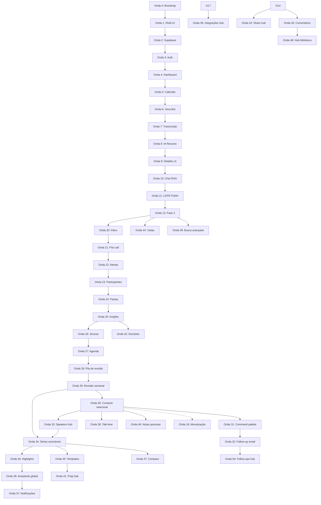
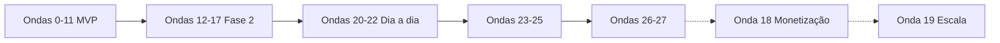
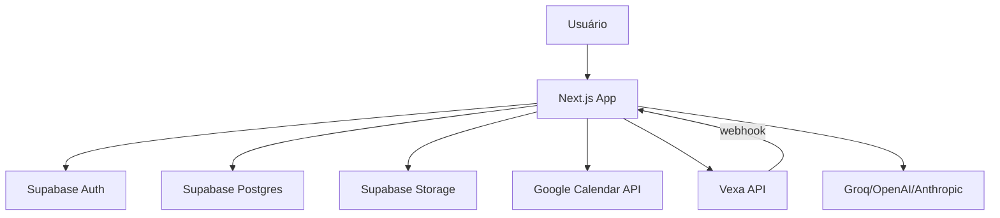

# ReuniAI — Plano de Implementação por Ondas

> SaaS individual de inteligência de reuniões (estilo Fireflies).  
> Stack: Next.js 15 · Supabase · Vexa (bot + transcrição) · LLM  
> UI: patterns de `case_agi` + design system **shadcn/ui Official** (design lab)

**Estimativa total MVP:** 6–8 semanas (1 dev experiente)  
**Última atualização:** julho 2026  
**Foco atual:** uso pessoal — lote 7 (Ondas 46–50): bibliotecas, descoberta e fechamento do loop pós-call. Monetização (Onda 18) postergada.

### Andamento das fases

| Onda | Nome | Status |
|------|------|--------|
| 0 | Bootstrap do projeto | ✅ Concluída |
| 1 | Design system e shell UI | ✅ Concluída |
| 2 | Supabase: schema, RLS e Storage | ✅ Concluída |
| 3 | Autenticação e onboarding | ✅ Concluída |
| 4 | Dashboard e lista de reuniões | ✅ Concluída |
| 5 | Google Calendar e sync | ✅ Concluída |
| 6 | Vexa: bot nas reuniões | ✅ Concluída |
| 7 | Pipeline de transcrição | ✅ Concluída |
| 8 | IA post-call: resumo e atribuições | ✅ Concluída |
| 9 | Detalhe da reunião (UI completa) | ✅ Concluída |
| 10 | Chat com IA (RAG) | ✅ Concluída |
| 11 | Segurança, LGPD e polish | ✅ Concluída |
| 12 | Descoberta e organização | ✅ Concluída |
| 13 | Inteligência proativa | ✅ Concluída |
| 14 | Colaboração e privacidade | ✅ Concluída |
| 15 | Qualidade e personalização | ✅ Concluída |
| 16 | Multi-plataforma enterprise | 🟡 Parcial (Outlook lib; Teams/Meet nativo pendente) |
| 17 | Integrações e automações | ✅ Concluída |
| **20** | **Inbox de compromissos** | ✅ Concluída |
| **21** | **Ritual pós-reunião** | ✅ Concluída |
| **22** | **Centro de alertas** | ✅ Concluída |
| **23** | **Diretório de participantes** | ✅ Concluída |
| **24** | **Pastas e organização** | ✅ Concluída |
| **25** | **Insights e tendências in-app** | ✅ Concluída |
| **26** | **Prioridade e snooze na inbox** | ✅ Concluída |
| **27** | **Agenda do dia unificada** | ✅ Concluída |
| **28** | **Fila de revisão em batch** | ✅ Concluída |
| **29** | **Revisão semanal in-app** | ✅ Concluída |
| **30** | **Contexto relacional e notas** | ✅ Concluída |
| **31** | **Command palette inteligente** | ✅ Concluída |
| **32** | **Follow-up transacional por email** | ✅ Concluída |
| **33** | **Hub global de speakers** | ✅ Concluída |
| **34** | **Séries recorrentes acionáveis** | ✅ Concluída |
| **35** | **Biblioteca de highlights** | ✅ Concluída |
| **36** | **Assistente global** | ✅ Concluída |
| **37** | **Centro de notificações** | ✅ Concluída |
| **38** | **Participação e talk-time** | ✅ Concluída |
| **39** | **Hub de integrações** | ✅ Concluída |
| **40** | **Templates de análise** | ✅ Concluída |
| **41** | **Hub de prep** | ✅ Concluída |
| **42** | **Registro de decisões** | ✅ Concluída |
| **43** | **Links compartilhados** | ✅ Concluída |
| **44** | **Vistas salvas** | ✅ Concluída |
| **45** | **Biblioteca de comentários** | ✅ Concluída |
| **46** | **Biblioteca de notas pessoais** | ✅ Concluída |
| **47** | **Comparador acionável** | ✅ Concluída |
| **48** | **Hub de biblioteca** | ✅ Concluída |
| **49** | **Busca semântica avançada** | ✅ Concluída |
| **50** | **Hub de follow-ups** | ✅ Concluída |
| 18 | Monetização e API (Stripe, REST, MCP) | ⏸️ Postergada |
| 19 | Escala e infra própria | 📋 Baixa prioridade |

---

## Índice

1. [Visão geral das ondas](#visão-geral-das-ondas)
2. [Pré-requisitos](#pré-requisitos)
3. [Onda 0 — Bootstrap do projeto](#onda-0--bootstrap-do-projeto)
4. [Onda 1 — Design system e shell UI](#onda-1--design-system-e-shell-ui)
5. [Onda 2 — Supabase: schema, RLS e Storage](#onda-2--supabase-schema-rls-e-storage)
6. [Onda 3 — Autenticação e onboarding](#onda-3--autenticação-e-onboarding)
7. [Onda 4 — Dashboard e lista de reuniões](#onda-4--dashboard-e-lista-de-reuniões)
8. [Onda 5 — Google Calendar e sync](#onda-5--google-calendar-e-sync)
9. [Onda 6 — Vexa: bot nas reuniões](#onda-6--vexa-bot-nas-reuniões)
10. [Onda 7 — Pipeline de transcrição](#onda-7--pipeline-de-transcrição)
11. [Onda 8 — IA post-call: resumo e atribuições](#onda-8--ia-post-call-resumo-e-atribuições)
12. [Onda 9 — Detalhe da reunião (UI completa)](#onda-9--detalhe-da-reunião-ui-completa)
13. [Onda 10 — Chat com IA (RAG)](#onda-10--chat-com-ia-rag)
14. [Onda 11 — Segurança, LGPD e polish](#onda-11--segurança-lgpd-e-polish)
15. [Ondas futuras — visão geral](#ondas-futuras--visão-geral)
16. [Onda 12 — Descoberta e organização](#onda-12--descoberta-e-organização)
17. [Onda 13 — Inteligência proativa](#onda-13--inteligência-proativa)
18. [Onda 14 — Colaboração e privacidade](#onda-14--colaboração-e-privacidade)
19. [Onda 15 — Qualidade da reunião e personalização](#onda-15--qualidade-da-reunião-e-personalização)
20. [Onda 16 — Multi-plataforma enterprise](#onda-16--multi-plataforma-enterprise)
21. [Onda 17 — Integrações e automações](#onda-17--integrações-e-automações)
22. [Onda 18 — Monetização e API](#onda-18--monetização-e-api)
23. [Onda 19 — Escala e infra própria](#onda-19--escala-e-infra-própria)
24. [Onda 20 — Inbox de compromissos](#onda-20--inbox-de-compromissos)
25. [Onda 21 — Ritual pós-reunião](#onda-21--ritual-pós-reunião)
26. [Onda 22 — Centro de alertas](#onda-22--centro-de-alertas)
27. [Onda 23 — Diretório de participantes](#onda-23--diretório-de-participantes)
28. [Onda 24 — Pastas e organização](#onda-24--pastas-e-organização)
29. [Onda 25 — Insights e tendências in-app](#onda-25--insights-e-tendências-in-app)
30. [Onda 26 — Prioridade e snooze na inbox](#onda-26--prioridade-e-snooze-na-inbox)
31. [Onda 27 — Agenda do dia unificada](#onda-27--agenda-do-dia-unificada)
32. [Onda 28 — Fila de revisão em batch](#onda-28--fila-de-revisão-em-batch)
33. [Onda 29 — Revisão semanal in-app](#onda-29--revisão-semanal-in-app)
34. [Onda 30 — Contexto relacional e notas](#onda-30--contexto-relacional-e-notas)
35. [Onda 31 — Command palette inteligente](#onda-31--command-palette-inteligente)
36. [Onda 32 — Follow-up transacional por email](#onda-32--follow-up-transacional-por-email)
37. [Onda 33 — Hub global de speakers](#onda-33--hub-global-de-speakers)
38. [Onda 34 — Séries recorrentes acionáveis](#onda-34--séries-recorrentes-acionáveis)
39. [Onda 35 — Biblioteca de highlights](#onda-35--biblioteca-de-highlights)
40. [Onda 36 — Assistente global](#onda-36--assistente-global)
41. [Onda 37 — Centro de notificações](#onda-37--centro-de-notificações)
42. [Onda 38 — Participação e talk-time](#onda-38--participação-e-talk-time)
43. [Onda 39 — Hub de integrações](#onda-39--hub-de-integrações)
44. [Onda 40 — Templates de análise](#onda-40--templates-de-análise)
45. [Onda 41 — Hub de prep](#onda-41--hub-de-prep)
46. [Onda 42 — Registro de decisões](#onda-42--registro-de-decisões)
47. [Onda 43 — Links compartilhados](#onda-43--links-compartilhados)
48. [Onda 44 — Vistas salvas](#onda-44--vistas-salvas)
49. [Onda 45 — Biblioteca de comentários](#onda-45--biblioteca-de-comentários)
50. [Onda 46 — Biblioteca de notas pessoais](#onda-46--biblioteca-de-notas-pessoais)
51. [Onda 47 — Comparador acionável](#onda-47--comparador-acionável)
52. [Onda 48 — Hub de biblioteca](#onda-48--hub-de-biblioteca)
53. [Onda 49 — Busca semântica avançada](#onda-49--busca-semântica-avançada)
54. [Onda 50 — Hub de follow-ups](#onda-50--hub-de-follow-ups)
55. [Variáveis de ambiente](#variáveis-de-ambiente)
56. [Critérios de aceite do MVP](#critérios-de-aceite-do-mvp)

---

## Visão geral das ondas



| Onda | Nome | Duração | Depende de | Entrega principal |
|------|------|---------|------------|-------------------|
| 0 | Bootstrap | 1–2 dias | — | Repo Next.js rodando |
| 1 | Shell UI | 2–3 dias | 0 | AppShell + tokens shadcn |
| 2 | Supabase | 2–3 dias | 0 | Schema + RLS + Storage |
| 3 | Auth | 2–3 dias | 1, 2 | Login + onboarding |
| 4 | Dashboard | 2–3 dias | 3 | KPIs + tabela reuniões |
| 5 | Calendar | 3–5 dias | 3, 2 | Sync eventos Google |
| 6 | Recall Bot | 3–5 dias | 5 | Bot entra na call |
| 7 | Transcrição | 3–5 dias | 6 | Deepgram + segments |
| 8 | IA Resumo | 2–3 dias | 7 | Summary + action items |
| 9 | Detalhe UI | 3–4 dias | 8 | Abas completas |
| 10 | Chat RAG | 3–4 dias | 8, 9 | Chat contextual |
| 11 | LGPD Polish | 3–5 dias | 10 | MVP production-ready |
| 12–17 | Fase 2 (produto) | contínuo | 11 | Ver seções 12–17 |
| **20–22** | **Produto do dia a dia** | **2–4 sem** | **12–13** | **Inbox, pós-call, alertas** |
| **23–25** | **Valor pessoal (lote 1)** | **2–3 sem** | **20–22** | **Participantes, pastas, insights** |
| **26–27** | **Valor pessoal (lote 2)** | **1–2 sem** | **20, 25** | **Snooze, agenda do dia** |
| **28–30** | **Valor pessoal (lote 3)** | **2–3 sem** | **21, 23, 27** | **Fila de revisão, revisão semanal, notas** |
| **31–35** | **Valor pessoal (lote 4)** | **2–3 sem** | **28–30** | **Navegação, email, speakers, séries, highlights** |
| **36–40** | **Valor pessoal (lote 5)** | **✅ Concluído** | **31–35** | **Assistente, alertas, talk-time, integrações, templates** |
| **41–45** | **Valor pessoal (lote 6)** | **✅ Concluído** | **13–14, 25, 30** | **Prep hub, decisões, share, vistas, comentários** |
| **46–50** | **Valor pessoal (lote 7)** | **✅ Concluído** | **30–34, 12, 32** | **Notas, compare, descoberta, busca, follow-ups** |
| 18 | Monetização (Stripe, API, MCP) | 2–3 sem | 30+ | ⏸️ Postergada — uso pessoal |
| 19 | Escala / infra | 3–6 meses | 18 | Self-hosted, orgs, SSO |

---

## Pré-requisitos

### Contas e APIs (criar antes da Onda 5)

| Serviço | Uso | Quando |
|---------|-----|--------|
| [Supabase](https://supabase.com) | Auth, DB, Storage | Onda 2 |
| [Vercel](https://vercel.com) | Deploy | Onda 0 |
| [Google Cloud Console](https://console.cloud.google.com) | OAuth + Calendar API | Onda 5 |
| [Vexa](https://github.com/Vexa-ai/vexa) | Meeting bots + transcrição Whisper | Onda 6 |
| Anthropic, OpenAI ou Groq | Resumo + chat | Onda 8 |
| OpenAI (embeddings) | RAG vetorial (opcional) | Onda 8 |

### Referências locais

| Recurso | Caminho |
|---------|---------|
| UI patterns | `C:\Users\pedro\Desktop\case_agi` |
| Design tokens shadcn | `design-lab.html` → bip-ai-hub `SystemShadcn` + `lab.css` |

---

## Onda 0 — Bootstrap do projeto

**Objetivo:** Repositório funcional com dependências alinhadas ao `case_agi`.

### Tarefas

- [x] Inicializar Next.js 15 (App Router, TypeScript, Tailwind v4, `src/` ou `app/` flat)
- [x] Copiar `package.json` deps de case_agi: `next`, `react`, `tailwindcss`, `@phosphor-icons/react`, `motion`, `sonner`, `zod`, `class-variance-authority`, `clsx`, `tailwind-merge`
- [x] Adicionar `@supabase/supabase-js`, `@supabase/ssr`
- [x] Configurar `components.json` (shadcn new-york, phosphor icons)
- [x] Instalar componentes shadcn base: `button`, `card`, `input`, `label`, `tabs`, `badge`, `separator`, `skeleton`, `dialog`, `select`, `tooltip`, `sonner`
- [x] Configurar `tsconfig` paths `@/*`
- [x] Configurar ESLint (eslint-config-next)
- [x] Criar `.env.local.example` com todas as vars documentadas
- [x] Configurar `middleware.ts` placeholder para Supabase session refresh
- [x] README com setup local

### Estrutura inicial

```
reuniai/
├── app/
│   ├── layout.tsx
│   ├── globals.css
│   └── page.tsx
├── components/ui/
├── lib/utils.ts
├── supabase/          # vazio até Onda 2
├── components.json
├── package.json
├── postcss.config.mjs
├── .env.local.example
└── implementation-plan.md
```

### Critérios de aceite

- `npm run dev` sem erros
- `npm run build` passa
- Página raiz renderiza

---

## Onda 1 — Design system e shell UI

**Objetivo:** Visual shadcn neutral + navegação persistente (port de case_agi).

### Tarefas

#### 1.1 Tokens CSS (`app/globals.css`)

- [x] Portar tokens de `lab.css` `.shadcn-scope` → `:root` global
- [x] Incluir `--chart-1` … `--chart-5`
- [x] Dark mode: `[data-theme="dark"]` ou `.dark` (tokens do design lab)
- [x] `--brand` teal para ícones IA: `oklch(0.55 0.15 180)`
- [x] Utilities: `.label-caps`, `.glass`, `.nav-active` (de case_agi `globals.css`)
- [x] Geist Sans + Geist Mono via `next/font/google`

#### 1.2 Shell (`components/shell/`)

- [x] `nav-config.ts` — rotas ReuniAI + `PRODUCT` metadata
- [x] `app-shell.tsx` — sidebar 260px, header 52px, mobile drawer
- [x] Logo ReuniAI (`components/brand/reuniai-logo.tsx`)
- [x] Layout `(app)/layout.tsx` com `AppShell`

#### 1.3 Motion e layout

- [x] `components/motion/presets.ts` — `fadeUp`, easings
- [x] `components/motion/page-transition.tsx`
- [x] `components/layout/page-header.tsx`

#### 1.4 Providers

- [x] `components/providers/app-providers.tsx` (mínimo: theme se necessário)
- [x] `Toaster` em root layout

### Nav items (MVP)

| href | label | icon |
|------|-------|------|
| `/` | Visão geral | House |
| `/reunioes` | Reuniões | VideoCamera |
| `/configuracoes` | Configurações | Gear |

### Critérios de aceite

- Sidebar + header responsivos
- Navegação entre rotas placeholder funciona
- Visual idêntico ao SystemShadcn (neutral, cards com border + shadow-sm)

---

## Onda 2 — Supabase: schema, RLS e Storage

**Objetivo:** Banco completo com isolamento multi-usuário nativo.

### Tarefas

#### 2.1 Projeto Supabase

- [x] Criar projeto Supabase (região próxima — ex: South America se disponível)
- [x] Habilitar extensão `vector` (pgvector)
- [x] Configurar `supabase/config.toml` para CLI local (opcional)

#### 2.2 Migration: enums e tabelas

```sql
-- Enums
CREATE TYPE meeting_platform AS ENUM ('google_meet', 'zoom', 'teams', 'other');
CREATE TYPE meeting_status AS ENUM (
  'scheduled', 'bot_joining', 'recording', 'processing',
  'completed', 'failed', 'cancelled', 'partial'
);
CREATE TYPE action_item_status AS ENUM ('open', 'done', 'cancelled');
CREATE TYPE calendar_provider AS ENUM ('google', 'outlook');
```

**Tabelas:**

| Tabela | Colunas principais |
|--------|-------------------|
| `profiles` | `id` (FK auth.users), `display_name`, `auto_join_enabled`, `retention_days`, `onboarding_completed`, `created_at` |
| `calendar_connections` | `id`, `user_id`, `provider`, `email`, `refresh_token_encrypted`, `sync_token`, `last_synced_at` |
| `meetings` | `id`, `user_id`, `calendar_event_id`, `title`, `started_at`, `ended_at`, `platform`, `meeting_url`, `status`, `recall_bot_id`, `duration_ms`, `recording_path`, `error_message` |
| `participants` | `id`, `meeting_id`, `name`, `email` |
| `transcript_segments` | `id`, `meeting_id`, `start_ms`, `end_ms`, `speaker_label`, `text`, `sequence` |
| `meeting_summaries` | `id`, `meeting_id`, `executive_summary`, `topics` (jsonb), `decisions` (jsonb), `raw_json` (jsonb) |
| `action_items` | `id`, `meeting_id`, `user_id`, `title`, `assignee`, `due_date`, `status`, `source` ('ai' \| 'manual') |
| `chat_messages` | `id`, `meeting_id`, `user_id`, `role`, `content`, `citations` (jsonb) |
| `transcript_embeddings` | `id`, `segment_id`, `meeting_id`, `embedding` vector(1536) |
| `webhook_events` | `id`, `provider`, `event_id`, `payload` (jsonb), `processed_at` — idempotência |

#### 2.3 RLS policies

- [x] `profiles`: user só acessa `id = auth.uid()`
- [x] Todas as tabelas com `user_id`: policy `auth.uid() = user_id`
- [x] `participants`, `transcript_segments`, etc.: via join `meetings.user_id = auth.uid()`
- [x] Trigger `on_auth_user_created` → insert `profiles`

#### 2.4 Storage

- [x] Bucket `recordings` — **private**
- [x] Policy SELECT/INSERT/DELETE: `(storage.foldername(name))[1] = auth.uid()::text`
- [x] Path convention: `{user_id}/{meeting_id}/recording.mp4`

#### 2.5 Client Supabase

- [x] `lib/supabase/client.ts` — browser client
- [x] `lib/supabase/server.ts` — server component / route handler
- [x] `lib/supabase/middleware.ts` — session refresh
- [x] `lib/supabase/admin.ts` — service role (só importar em `app/api/`)
- [x] `npm run gen:types` → `lib/supabase/database.types.ts`

### Critérios de aceite

- Migrations aplicam sem erro
- Usuário A não pode SELECT meetings de usuário B (testar manualmente ou script)
- Upload teste no bucket respeita RLS

---

## Onda 3 — Autenticação e onboarding

**Objetivo:** Usuários podem criar conta, logar e completar setup inicial.

### Tarefas

#### 3.1 Auth pages (`app/(auth)/`)

- [x] `/login` — email + senha + Google OAuth
- [x] `/signup` — email + senha + confirmação
- [x] `/auth/callback` — route handler Supabase OAuth
- [x] Redirect: não autenticado → `/login`; autenticado em `/login` → `/`

#### 3.2 Middleware

- [x] Proteger rotas `(app)/*` exceto auth e webhooks
- [x] Refresh session em cada request

#### 3.3 Onboarding (`app/(onboarding)/onboarding/`)

- [x] Fluxo em steps (boas-vindas, LGPD, auto-join, calendário skip)
- [x] Ao completar: `profiles.onboarding_completed = true`

#### 3.4 Settings base

- [x] `/configuracoes` com e-mail e auto-join
- [x] Botão logout
- [x] Link deletar conta (stub até Onda 11)

### Critérios de aceite

- Signup → login → onboarding → dashboard (shell vazio)
- Session persiste após refresh
- Google OAuth funciona em produção (Vercel)

---

## Onda 4 — Dashboard e lista de reuniões

**Objetivo:** UI principal com dados mock; depois plugar Supabase real.

### Tarefas

#### 4.1 Dashboard (`app/(app)/page.tsx`)

Layout SystemShadcn (4 KPI cards + grid):

| KPI | Valor exemplo | Detalhe |
|-----|---------------|---------|
| Reuniões este mês | `12` | +2 vs mês anterior |
| Horas gravadas | `8.5h` | Total processado |
| Action items abertos | `5` | Pendentes |
| Próxima reunião | `14:00` | Título do evento |

- [x] `components/dashboard/kpi-cards.tsx`
- [x] `components/dashboard/recent-meetings-table.tsx` — colunas: título, data, plataforma, status, duração
- [x] `components/dashboard/attention-card.tsx` — action items vencidos/próximos
- [x] `components/dashboard/meetings-chart.tsx` — reuniões por semana (recharts, integrado no dashboard via `getMeetingsWeeklyChart()`)

#### 4.2 Lista de reuniões (`app/(app)/reunioes/page.tsx`)

- [x] Data table com sort por data
- [x] Filtros: status, plataforma, busca por título
- [x] Badge de status com cores (scheduled=muted, recording=warning, completed=success, failed=destructive)
- [x] Link row → `/reunioes/[id]`

#### 4.3 Data layer

- [x] `lib/meetings/queries.ts` — `getMeetingsForUser`, `getMeetingById`, stats do dashboard
- [x] Server Components fetching Supabase (seed opcional via `npm run db:seed`)
- [x] `lib/meetings/types.ts` + helpers de formatação e labels

#### 4.4 Status badges

```typescript
const STATUS_LABELS: Record<MeetingStatus, string> = {
  scheduled: 'Agendada',
  bot_joining: 'Bot entrando',
  recording: 'Gravando',
  processing: 'Processando',
  completed: 'Concluída',
  failed: 'Falhou',
  cancelled: 'Cancelada',
  partial: 'Parcial',
};
```

### Critérios de aceite

- Dashboard renderiza com 0 reuniões (empty state elegante)
- Seed script opcional popula 5 reuniões mock para dev
- Tabela pagina ou limita a 50 items

---

## Onda 5 — Google Calendar e sync

**Objetivo:** Ler eventos do calendário, detectar links de reunião, criar registros `meetings`.

### Tarefas

#### 5.1 Google Cloud setup

- [ ] Projeto GCP com Calendar API habilitada
- [ ] OAuth credentials (Web application)
- [ ] Scopes: `https://www.googleapis.com/auth/calendar.readonly`
- [ ] Redirect URI: `{APP_URL}/api/calendar/callback`

#### 5.2 OAuth flow

- [x] `GET /api/calendar/connect` — redirect Google OAuth
- [x] `GET /api/calendar/callback` — recebe tokens, salva em `calendar_connections`
- [x] Encrypt refresh_token antes de salvar (`lib/crypto/token-encrypt.ts` — AES-256-GCM com `ENCRYPTION_KEY` env)

#### 5.3 Sync job

- [x] `POST /api/calendar/sync` — manual trigger (botão em configurações)
- [x] Cron Vercel `/api/cron/calendar-sync` — cada 15 min (proteger com `CRON_SECRET`)
- [x] `lib/calendar/google.ts`:
  - Listar eventos próximos 7 dias + passados 30 dias
  - Extrair URL de meeting (regex Meet/Zoom/Teams)
  - Upsert `meetings` por `calendar_event_id`
  - Detectar `platform` enum

#### 5.4 Detecção de plataforma

```typescript
function detectPlatform(url: string): MeetingPlatform {
  if (url.includes('meet.google.com')) return 'google_meet';
  if (url.includes('zoom.us')) return 'zoom';
  if (url.includes('teams.microsoft.com') || url.includes('teams.live.com')) return 'teams';
  return 'other';
}
```

#### 5.5 UI configurações

- [x] Card "Google Calendar" — conectado/desconectado, email, último sync
- [x] Botão "Sincronizar agora"
- [x] Toggle auto-join (salva em `profiles`)

### Critérios de aceite

- Conectar calendário → eventos com link aparecem em `/reunioes` com status `scheduled`
- Re-sync não duplica meetings (unique constraint `user_id + calendar_event_id`)
- Desconectar remove connection (não meetings históricas)

---

## Onda 6 — Vexa: bot nas reuniões ✅

**Objetivo:** Bot ReuniAI entra (manual ou automaticamente) nas reuniões e grava/transcreve.

> **Decisão:** trocamos Recall.ai pelo **[Vexa](https://github.com/Vexa-ai/vexa)** — alternativa open-source (Apache 2.0). API quase idêntica (POST URL → GET transcript) e que já cobre gravação **e** transcrição (Whisper). Modo **cloud** (`https://api.cloud.vexa.ai`, $5 grátis) para validar agora; mesmo código migra para **self-hosted** (`http://localhost:8056`, custo zero) trocando só `VEXA_API_BASE`.

### Tarefas

#### 6.1 Setup ✅

- [x] Env: `VEXA_API_BASE`, `VEXA_API_KEY`, `VEXA_WEBHOOK_SECRET`, `NEXT_PUBLIC_BOT_NAME`
- [x] Registrar webhook (público): `npm run vexa:webhook -- https://seu-dominio.com` → `scripts/vexa-set-webhook.mjs`

#### 6.2 Client Vexa (`lib/vexa/client.ts`) ✅

- [x] `createBot({ platform, nativeMeetingId, ... })` — recording + transcribe realtime
- [x] `stopBot(platform, nativeMeetingId)` (idempotente em 404)
- [x] `getRunningBots()` / `getTranscript()` / `setUserWebhook()`
- [x] `lib/meetings/meeting-url.ts` — parse plataforma + `native_meeting_id` (Meet/Zoom)

#### 6.3 Scheduler ✅

- [x] `lib/vexa/scheduler.ts` — `startBotForMeeting()` + `scheduleBotsForUpcomingMeetings()` (janela: 5 min antes, 2 h de tolerância; só usuários com `auto_join_enabled`)
- [x] Cron `/api/cron/schedule-bots` — cada 5 min (protegido por `CRON_SECRET`)
- [x] Update meeting: `status = bot_joining`, `recall_bot_id = native_meeting_id`

#### 6.4 Webhook handler (`app/api/webhooks/vexa/route.ts`) ✅

Mapeamento `meeting.status_change`:

| Status Vexa | Status interno |
|-------------|----------------|
| `requested` / `joining` / `awaiting_admission` | `bot_joining` |
| `active` | `recording` |
| `completed` | `completed` (+ `ended_at`, `duration_ms`) |
| `failed` | `failed` (+ `error_message`) |

- [x] Idempotência via `webhook_events` (provider `vexa` + `event_id`)
- [x] Auth via `Authorization: Bearer <VEXA_WEBHOOK_SECRET>`
- [x] Service role para updates (`lib/vexa/sync.ts`)
- [x] `recording.completed` → ingestão de transcript fica para Onda 7

#### 6.5 Fallback de status + UI ✅

- [x] Cron `/api/cron/poll-bots` — fallback sem webhook público (localhost): consulta `getRunningBots()` e fecha reuniões encerradas
- [x] Cron `/api/cron/poll-native-transcripts` — fallback para transcrições nativas (Teams/Meet) quando o webhook não dispara; agendado em `.github/workflows/cron.yml`
- [x] Rotas manuais `/api/bots/start` e `/api/bots/stop` (autenticadas)
- [x] UI: `components/meetings/bot-actions.tsx` na tabela (Enviar bot / Parar bot)

#### 6.6 Bot branding ✅

- [x] Nome configurável via `NEXT_PUBLIC_BOT_NAME` (default `ReuniAI Bot`)
- [x] Página pública `/recording-notice` (aviso LGPD), liberada no middleware

### Critérios de aceite

- [x] Bot enviado manualmente entra na call (botão na tabela de reuniões)
- [x] Status atualiza via webhook (prod) ou poll (`/api/cron/poll-bots`, local)
- [x] Webhooks/crons públicos sem redirect de sessão; demais rotas protegidas

> **Pendente do usuário:** preencher `VEXA_API_KEY` (vexa.ai/account, $5 grátis) para testar.

### ⚠️ Crédito grátis e plano de migração para custo zero

**Situação atual (cloud):**

- Estamos usando o **Vexa Cloud** (`VEXA_API_BASE=https://api.cloud.vexa.ai`).
- O crédito grátis é de **$5 por conta** (~16h de bot a $0,30/h). **Não é recorrente** — depois disso vira pago ($0,30/h de bot + $0,20/h de transcrição realtime).
- Os dados (áudio/transcrição) passam pela infraestrutura do Vexa enquanto estivermos no cloud.

**Pontos a resolver / dúvidas em aberto:**

- [ ] Confirmar quanto do crédito de $5 já foi consumido (dashboard em vexa.ai/account).
- [ ] Definir gatilho de migração: migrar **antes** do crédito acabar para não interromper o serviço.
- [ ] Validar requisitos do self-hosted (Vexa precisa de Docker em Linux; transcrição Whisper pede CPU/RAM razoável ou GPU para realtime).

**Plano de migração (substituir cloud por custo zero):**

1. **Opção A — Docker local:** subir o Vexa com `make lite` (container único) na própria máquina/servidor. Bom para dev e volume baixo.
2. **Opção B — VM grátis:** hospedar o Vexa numa VM de free tier (ex.: Oracle Cloud Always Free, e2-micro do GCP, ou similar) com Docker. Precisa ser **Linux sempre disponível** no horário das reuniões.
3. **Troca no código:** mudar apenas `VEXA_API_BASE` para `http://localhost:8056` (ou o IP/host da VM). **Nenhuma outra alteração de código é necessária** — client, scheduler, webhook e poll já são agnósticos.
4. **Webhook:** rodar `npm run vexa:webhook -- <URL pública>` apontando para o app; no self-hosted local sem URL pública, continuar usando o fallback `/api/cron/poll-bots`.
5. **Transcrição:** no self-hosted, é possível usar Whisper local (sem custo de API) — fecha o ciclo de custo zero também na Onda 7.

> **Decisão registrada:** começar no cloud (rápido, $5 grátis para validar) e **substituir posteriormente por VM grátis ou Docker local** assim que o fluxo estiver validado, mantendo o mesmo código.

---

## Onda 7 — Pipeline de transcrição ✅

**Objetivo:** Transcrição da reunião com timestamps e speakers, exibida na UI.

> **Decisão:** o Vexa já transcreve via Whisper (100+ idiomas, com diarização). Em vez de baixar a gravação e mandar para o Deepgram, **buscamos os segmentos prontos** em `GET /transcripts/{platform}/{id}` e persistimos. Custo de transcrição = $0 no self-hosted (Whisper local). Deepgram foi removido do escopo.

### Tarefas

#### 7.1 Ingestão (`lib/pipeline/ingest-transcript.ts`) ✅

- [x] `ingestMeetingTranscript()` — busca transcript no Vexa, converte tempos (s → ms), persiste em `transcript_segments`
- [x] Idempotente: `delete` + `insert` por `meeting_id`; `sequence` reordenada
- [x] Status: `processing` → `completed` (com trechos) ou `partial` (sem trechos)
- [x] `ingestByNativeId()` — resolve a reunião via `recall_bot_id` e ingere

#### 7.2 Gatilhos ✅

- [x] Webhook (`recording.completed` ou status `completed`) → ingestão automática
- [x] Cron `/api/cron/poll-bots` (fallback local) → ingere ao detectar reunião encerrada
- [x] Rota manual `POST /api/bots/transcript` (autenticada) para re-buscar sob demanda

#### 7.3 Query + helpers ✅

- [x] `lib/meetings/transcript.ts` — `getTranscriptSegments()` + `formatTimestamp(ms)`

#### 7.4 UI ✅

- [x] `components/meetings/transcript-view.tsx` — lista de segments com timestamp mono e badge de speaker (cor por participante)
- [x] `app/(app)/reunioes/[id]/page.tsx` — página de detalhe (header, status, plataforma, transcrição)
- [x] `components/meetings/transcript-sync-button.tsx` — botão "Buscar transcrição"

> **Entregue na Onda 9:** player de gravação com seek (`components/meetings/recording-player.tsx`), proxy autenticado (`/api/meetings/[id]/recording`) e highlight do segment ativo na transcrição.

### Critérios de aceite

- [x] Reunião encerrada gera segments no DB (via webhook/poll ou botão manual)
- [x] Transcrição visível na página de detalhe com timestamp e speaker
- [x] Ingestão idempotente (re-buscar não duplica trechos)

---

## Onda 8 — IA post-call: resumo e atribuições ✅

**Objetivo:** Extrair valor automaticamente da transcrição.

> **Multi-provedor:** o LLM é selecionável por `LLM_PROVIDER` (**groq** | openai | anthropic). Se vazio, usa o primeiro com chave (ordem groq > openai > anthropic). Groq e OpenAI compartilham o mesmo caminho (API compatível, `response_format: json_object`); Anthropic tem caminho próprio. Default sugerido: **Groq** (free tier, rápido).

### Tarefas

#### 8.1 LLM client (`lib/llm/client.ts`) ✅

- [x] Multi-provedor: Groq/OpenAI (compatível) + Anthropic
- [x] `generateJson({ system, user })` com timeout 60s (AbortController)
- [x] `getLlmProvider()` / `isLlmConfigured()` (resolução por env/chave)
- [x] `extractJson()` tolerante a cercas markdown

#### 8.2 Schema de resumo (Zod) ✅

- [x] `lib/llm/meeting-analysis.ts` — `MeetingAnalysisSchema` (executive_summary, topics, decisions, action_items) com defaults

#### 8.3 Prompt engineering ✅

- [x] System PT-BR: "não invente informações; datas ISO só quando explícitas"
- [x] Transcript truncado defensivamente (>100k chars)
- [x] `PROMPT_VERSION = v1` (auditoria)

#### 8.4 Persist (`lib/pipeline/analyze-meeting.ts`) ✅

- [x] Upsert `meeting_summaries` (por `meeting_id`)
- [x] Recria `action_items` `source = 'ai'` (preserva os manuais)
- [x] `status = completed`; em falha → `failed` + `error_message`
- [x] Pipeline `lib/pipeline/process-meeting.ts` (ingestão → análise), disparada em webhook/poll/rota manual
- [x] No-op silencioso se nenhum provedor estiver configurado (não quebra o fluxo)

#### 8.5 Embeddings (prep para Onda 10) ✅

- [x] `lib/embeddings/generate.ts` — `text-embedding-3-small` (OpenAI), batelado por segmento
- [x] Insert `transcript_embeddings` (idempotente por reunião)
- [x] **Opcional**: só roda se `EMBEDDINGS_API_KEY` existir; não bloqueia a análise (Groq não tem embeddings)

#### 8.6 UI (parcial — completa na Onda 9) ✅

- [x] `components/meetings/summary-view.tsx` — resumo executivo, tópicos e decisões
- [x] `components/meetings/action-items-list.tsx` — lista (read-only por enquanto)
- [x] Integrado em `app/(app)/reunioes/[id]/page.tsx`

### Critérios de aceite

- [x] Reunião com transcript → summary + action items no DB
- [x] Resumo em PT-BR coerente; provedor trocável por env
- [x] Falha LLM → `status = failed` com mensagem, sem corromper dados
- [x] Funciona só com Groq (embeddings desligados automaticamente)

---

## Onda 9 — Detalhe da reunião (UI completa) ✅

**Objetivo:** Página `/reunioes/[id]` com todas as abas funcionais.

### Tarefas

#### 9.1 Layout (`app/(app)/reunioes/[id]/page.tsx`) ✅

- [x] `PageHeader` — título, data, duração, badges de status/plataforma, link da call
- [x] Tabs (`components/meetings/meeting-tabs.tsx`): Resumo | Atribuições | Transcrição | Chat
- [x] Badge com contagem de itens em aberto na aba Atribuições

#### 9.2 Aba Resumo ✅

- [x] `components/meetings/summary-view.tsx` (Onda 8) — resumo executivo em card, tópicos e decisões

#### 9.3 Aba Transcrição ✅

- [x] `components/meetings/transcript-view.tsx` — segments com timestamp e speaker
- [x] `components/meetings/recording-player.tsx` — player responsivo com seek, velocidade e highlight do segment ativo via `highlightMs`
- [x] Proxy de gravação: `app/api/meetings/[id]/recording/route.ts` e `.../stream/route.ts`

#### 9.4 Aba Atribuições (`components/meetings/action-items-tab.tsx`) ✅

- [x] Lista com checkbox (toggle `done`, otimista)
- [x] Editar título, assignee e due_date inline
- [x] Adicionar item manual (`source = manual`)
- [x] Deletar item

#### 9.5 API mutations ✅

- [x] `POST /api/meetings/[id]/action-items` (criar, Zod)
- [x] `PATCH /api/meetings/[id]/action-items/[itemId]` (editar/toggle, Zod)
- [x] `DELETE /api/meetings/[id]/action-items/[itemId]`
- [x] Ownership: verifica `meeting.user_id`/`item.user_id` antes de gravar (admin client)

#### 9.6 Empty e loading states ✅

- [x] `components/meetings/meeting-status-banner.tsx` — info enquanto `processing`/`recording`/`bot_joining`
- [x] Mensagem clara para `failed` com `error_message`
- [x] `partial` — "transcrição parcial disponível"
- [x] Empty states nas abas (resumo, transcrição e atribuições)

### Critérios de aceite

- [x] Abas funcionam com dados reais
- [x] Edição/criação/remoção de action item persiste (refletirá no "attention card" do dashboard)
- [x] Tabs com `flex-wrap` (responsivo)
- [x] Player responsivo com seek sincronizado à transcrição e citações do chat

---

## Onda 10 — Chat com IA (RAG) ✅

**Objetivo:** Perguntar sobre a reunião com respostas citando timestamps.

> **RAG sem migração:** quando há `EMBEDDINGS_API_KEY`, a busca vetorial roda **em memória** (cosseno em Node sobre os embeddings da reunião) — sem precisar de RPC/pgvector query. Sem chave de embeddings (caso Groq), o contexto é a **transcrição completa** (truncada por orçamento). Em ambos os casos o LLM cita trechos por número e mapeamos para `{ start_ms, text }`.

### Tarefas

#### 10.1 UI do chat ✅

- [x] `components/ia/meeting-chat.tsx` — lista de mensagens, input, estado "Pensando…"
- [x] Prompts sugeridos embutidos (`MEETING_PROMPTS`)
- [x] Bolhas com citações clicáveis

#### 10.2 Suggested prompts ✅

- [x] "Quais foram as decisões tomadas?", "Liste todos os itens de ação", "Resuma em 3 bullet points", "O que ficou pendente?"

#### 10.3 RAG (`lib/rag/meeting-context.ts`) ✅

- [x] `buildMeetingContext()` — resumo executivo + trechos relevantes
- [x] Busca vetorial em memória (top-8 por cosseno) quando há embeddings
- [x] Fallback para transcrição completa truncada (sem embeddings)
- [x] `embedQuery` / `cosineSimilarity` / `parseVector` em `lib/embeddings/generate.ts`

#### 10.4 API (`POST /api/meetings/[id]/chat`) ✅

- [x] Valida ownership do meeting
- [x] Rate limit 20 req/min/usuário (in-memory)
- [x] Persist `chat_messages` (user + assistant) via admin
- [x] Resposta: `{ content, citations: [{ start_ms, text }] }`
- [x] 503 se nenhum provedor de IA configurado

#### 10.5 Citações na UI ✅

- [x] Chips "02:34" abaixo da resposta
- [x] Click → toast com o texto do trecho (seek do player virá com o player diferido)

### Critérios de aceite

- [x] "Quais itens de ação?" retorna lista coerente com a transcrição
- [x] Citações apontam timestamps reais dos trechos usados
- [x] Chat é escopado por reunião (contexto só daquela reunião)
- [x] Histórico de chat persiste ao recarregar (carregado no server)

---

## Onda 11 — Segurança, LGPD e polish

**Objetivo:** MVP production-ready.

### Tarefas

#### 11.1 Delete completo

- [x] `DELETE /api/meetings/[id]` — segments, summary, action_items, embeddings, chat, Storage file, meeting row
- [x] `DELETE /api/account` — todas meetings + calendar_connection + profile + auth.users (service role)
- [x] UI confirmação com digitar "DELETAR"

#### 11.2 Retenção automática

- [x] Cron `/api/cron/retention` — deletar meetings > `profiles.retention_days`
- [x] Default 365 dias

#### 11.3 Busca

- [x] Busca full-text em título + transcript (`ILIKE` ou `tsvector` — simples primeiro)
- [x] Input no header (`components/shell/meeting-search.tsx` → `/reunioes?q=`) e busca semântica via command palette (`/busca`)

#### 11.4 Export

- [x] `GET /api/meetings/[id]/export?format=md`
- [x] Markdown: título, resumo, action items, transcript completo

#### 11.5 Email digest (opcional MVP)

- [x] Resend + templates HTML (`lib/email/meeting-completed.ts`, `lib/email/weekly-digest.ts`)
- [x] Após `status = completed`, email com resumo + link (quando `notification_prefs.email` ativo)
- [x] Cron semanal `/api/cron/weekly-digest` (domingo 9h UTC via `vercel.json`)

#### 11.6 Dark mode

- [x] Toggle em configurações
- [x] `data-theme="dark"` no `<html>`
- [x] Tokens dark do design lab

#### 11.7 Testes de isolamento

- [x] Script ou teste: user A cria meeting, user B GET `/api/meetings/{id}` → 404
- [x] Storage: user B não acessa signed URL de user A (ver `supabase/tests/rls_isolation_notes.sql`)

#### 11.8 Error monitoring

- [x] Structured logging em webhooks
- [x] Vercel Analytics + Speed Insights em `app/layout.tsx` (Sentry permanece opcional)

#### 11.9 Performance

- [x] Índices: `meetings(user_id, started_at)`, `transcript_segments(meeting_id, sequence)`
- [x] Paginação cursor-based na lista de reuniões (default, busca `?q=` e filtros avançados)

### Critérios de aceite

- Checklist LGPD: consentimento, delete, retenção, gravações privadas
- Build produção sem warnings
- Lighthouse performance > 80 na dashboard

---

## Ondas futuras — visão geral

As ondas 0–11 entregam o **MVP**. As ondas **12–17** e **20–22** fecham o loop de uso diário. A prioridade **atual** (jul/2026) é **valor de produto para uso pessoal** (ondas 28–40). Monetização (18) e escala (19) ficam **postergadas** até decisão de comercializar.



| Onda | Fase | Tema | Status |
|------|------|------|--------|
| 12 | Produto | Descoberta e organização | ✅ |
| 13 | Produto | Inteligência proativa | ✅ |
| 14 | Produto | Colaboração e privacidade | ✅ |
| 15 | Produto | Qualidade e personalização | ✅ |
| 16 | Plataforma | Multi-plataforma enterprise | 🟡 Parcial |
| 17 | Plataforma | Integrações | ✅ |
| **20** | **Dia a dia** | **Inbox de compromissos** | **✅** |
| **21** | **Dia a dia** | **Ritual pós-reunião** | **✅** |
| **22** | **Dia a dia** | **Centro de alertas** | **✅** |
| **23** | **Valor pessoal** | **Diretório de participantes** | **✅** |
| **24** | **Valor pessoal** | **Pastas e organização** | **✅** |
| **25** | **Valor pessoal** | **Insights in-app** | **✅** |
| **26** | **Valor pessoal** | **Prioridade e snooze** | **✅** |
| **27** | **Valor pessoal** | **Agenda do dia** | **✅** |
| **28** | **Valor pessoal** | **Fila de revisão em batch** | **✅** |
| **29** | **Valor pessoal** | **Revisão semanal in-app** | **✅** |
| **30** | **Valor pessoal** | **Contexto relacional e notas** | **✅** |
| **31** | **Valor pessoal** | **Command palette inteligente** | **✅** |
| **32** | **Valor pessoal** | **Follow-up transacional** | **✅** |
| **33** | **Valor pessoal** | **Hub de speakers** | **✅** |
| **34** | **Valor pessoal** | **Séries acionáveis** | **✅** |
| **35** | **Valor pessoal** | **Biblioteca de highlights** | **✅** |
| **36** | **Valor pessoal** | **Assistente global** | **✅** |
| **37** | **Valor pessoal** | **Centro de notificações** | **✅** |
| **38** | **Valor pessoal** | **Participação / talk-time** | **✅** |
| **39** | **Valor pessoal** | **Hub de integrações** | **✅** |
| **40** | **Valor pessoal** | **Templates de análise** | **✅** |
| **41** | **Valor pessoal** | **Hub de prep** | **📋 Próxima** |
| **42** | **Valor pessoal** | **Registro de decisões** | **📋** |
| **43** | **Valor pessoal** | **Links compartilhados** | **📋** |
| **44** | **Valor pessoal** | **Vistas salvas** | **📋** |
| **45** | **Valor pessoal** | **Biblioteca de comentários** | **📋** |
| 18 | Plataforma | Stripe + API REST + MCP | ⏸️ Postergada |
| 19 | Escala | Infra própria | 📋 Baixa prioridade |

**Features recomendadas originalmente** (distribuídas nas ondas abaixo):

| Feature | Onda |
|---------|------|
| Meeting Prep | 13 |
| Follow-up draft | 13 |
| Detecção de compromissos | 13 |
| Highlight bookmarks | 15 |
| Talk-time analytics | 15 |
| PT-BR default + multi-idioma | 15 |

**Quatro features novas recomendadas:**

| Feature | Onda | Por quê |
|---------|------|---------|
| Séries de reuniões recorrentes | 12 | Standups semanais são o caso de uso #1; contexto entre ocorrências |
| Mapeamento persistente de speakers | 15 | Diarização genérica ("Speaker 1") frustra; nomes reais aumentam confiança |
| Redação de PII no share/export | 14 | LGPD + share seguro sem vazar dados sensíveis falados na call |
| Templates de análise por tipo de reunião | 15 | Standup ≠ vendas ≠ 1:1; resumos genéricos perdem precisão |

---

## Onda 12 — Descoberta e organização

**Objetivo:** Encontrar e organizar reuniões quando a biblioteca cresce (50+ calls).

**Estimativa:** 1–2 semanas  
**Depende de:** Onda 11 (MVP), embeddings da Onda 8

### Features

#### 12.1 Busca semântica global

- Perguntas em linguagem natural em **todas** as reuniões: "o que decidimos sobre pricing?"
- `pgvector` cross-meeting: embed query → top segments de qualquer `meeting_id` do usuário
- UI: barra de busca no header → página `/busca` com resultados agrupados por reunião + snippet + link ao timestamp
- Fallback full-text (`tsvector`) para título e participantes

#### 12.2 Tags e pastas

- Tabelas: `tags`, `meeting_tags`; pastas opcionais `folders` com `parent_id`
- UI: multi-select tags na lista; filtro por tag/pasta
- Auto-tag por IA (opcional): LLM sugere 2–3 tags após processamento

#### 12.3 Séries de reuniões recorrentes *(nova)*

- Agrupar por `calendar_recurring_event_id` do Google Calendar
- Página `/series/[id]` — timeline de todas as ocorrências
- Card na dashboard: "Sua série Weekly Sync — 8 reuniões"
- Chat scoped à série: "o que mudou nas últimas 3 semanas?"
- Evolução de tópicos: diff automático entre resumos consecutivos

#### 12.4 Filtros avançados na lista

- Por participante (email), plataforma, duração, presença de action items abertos
- Salvar filtros como "vistas" (`saved_views` jsonb em `profiles`)

### Critérios de aceite

- Busca retorna resultado relevante em < 2s com 100 reuniões seed
- Série recorrente agrupa 4+ ocorrências automaticamente
- Tags persistem e filtram corretamente

---

## Onda 13 — Inteligência proativa

**Objetivo:** IA que age **antes e depois** da reunião, não só durante a revisão.

**Estimativa:** 1–2 semanas  
**Depende de:** Onda 5 (calendar), Onda 8 (summaries)

### Features

#### 13.1 Meeting Prep

- Cron 5 min antes de `started_at`: se há participantes em comum com reuniões anteriores
- Gera briefing: decisões pendentes, action items abertos, resumo da última call com o mesmo grupo
- Entrega: notificação in-app + email opcional + card na home "Próxima: Weekly Sync em 5 min"
- Link direto ao histórico da série (Onda 12.3)

#### 13.2 Follow-up draft

- Após `status = completed`: LLM gera email de follow-up em PT-BR
- Estrutura: agradecimento, decisões, action items com responsáveis, próximos passos
- UI: aba ou modal "Copiar email" + editar antes de enviar (não envia automaticamente no MVP desta onda)

#### 13.3 Detecção de compromissos

- Segunda passada LLM no transcript: frases com compromisso temporal ("mando na sexta", "até amanhã")
- Sugere `action_items` com `due_date` inferida + badge "Sugerido pela IA"
- Usuário aceita/rejeita em batch na aba Atribuições

#### 13.4 Digest semanal

- Email resumo: N reuniões, top decisões, action items vencendo, horas gravadas
- Cron domingo 8h (timezone do usuário em `profiles`)

### Critérios de aceite

- Prep aparece para reunião com histórico de participantes em comum
- Follow-up coerente com action items do DB
- Compromisso "envio o relatório na sexta" gera sugestão com data

---

## Onda 14 — Colaboração e privacidade

**Objetivo:** Compartilhar insights com segurança; ampliar alcance sem data leak.

**Estimativa:** 1–2 semanas  
**Depende de:** Onda 11 (LGPD base)

### Features

#### 14.1 Share links read-only

- `share_tokens` table: `meeting_id`, `token`, `expires_at`, `scopes` (summary_only | full_transcript)
- URL pública `/s/[token]` — sem login, layout simplificado sem sidebar
- Revogar link em configurações da reunião

#### 14.2 Export avançado

- PDF formatado (resumo + action items + transcript paginado)
- Markdown (já no MVP Onda 11) + JSON estruturado para integrações

#### 14.3 Redação de PII *(nova)*

- Antes de share/export: scan LLM + regex para emails, telefones, CPF/CNPJ, cartões, senhas faladas
- UI toggle: "Redigir dados sensíveis" (default **on** para share links)
- Substituir com `[REDACTED]` no texto exportado; gravação original intacta no Storage
- Log de redações em `export_audit` para compliance

#### 14.4 Comentários internos (leve)

- `meeting_comments` — notas do usuário em timestamp específico
- Não é colaboração multi-user no SaaS individual; é anotação pessoal na timeline

### Critérios de aceite

- Link expirado retorna 404
- Export com redação não contém CPF de teste inserido no transcript
- PDF abre e é legível

---

## Onda 15 — Qualidade da reunião e personalização

**Objetivo:** Transcrição e resumos mais úteis; métricas de eficiência da call.

**Estimativa:** 1–2 semanas  
**Depende de:** Onda 7 (segments), Onda 8 (summary)

### Features

#### 15.1 Talk-time analytics

- Agregar `transcript_segments` por `speaker_label`: % tempo de fala, palavras, turnos
- UI: bar chart na aba Resumo ou card dedicado
- Útil para coaching, reuniões desbalanceadas, standups

#### 15.2 Highlight bookmarks

- `meeting_highlights`: `meeting_id`, `start_ms`, `end_ms`, `label`, `created_by`
- UI: botão "Marcar momento" no player + lista de highlights clicáveis
- Export inclui seção "Momentos marcados"

#### 15.3 Mapeamento persistente de speakers *(nova)*

- UI após primeira reunião: "Speaker 1 → Pedro", "Speaker 2 → Maria"
- `speaker_mappings`: `user_id`, `participant_email` ou `label_pattern`, `display_name`
- Pipeline reprocessa labels em segments futuros quando email do participante coincide
- Heurística: primeiro speaker ≈ host quando metadata do Recall disponível

#### 15.4 Templates de análise por tipo *(nova)*

- `analysis_templates`: standup, vendas, 1:1, retrospectiva, genérico
- Usuário escolhe template na reunião ou auto-detect por título do calendário ("Daily", "Demo")
- Cada template: system prompt diferente + schema Zod (ex: standup → blockers + yesterday + today)
- Settings: template default por série recorrente

#### 15.5 Multi-idioma na transcrição

- Deepgram `detect_language` ou hint por `profiles.locale`
- PT-BR default; EN, ES como opções
- Resumo sempre no idioma preferido do usuário

### Critérios de aceite

- Talk-time soma ~100% da duração falada
- Template standup não gera seção "decisões de pricing"
- Speaker mapping persiste na segunda reunião com mesmos participantes

---

## Onda 16 — Multi-plataforma enterprise

**Objetivo:** Outlook, Teams nativo, Meet Workspace — para usuários que já gravam na plataforma.

**Estimativa:** 2–3 semanas  
**Depende de:** Onda 5 (calendar patterns)

### Features

#### 16.1 Outlook Calendar

- Microsoft Graph OAuth + sync paralelo ao Google
- `calendar_connections.provider = outlook`

#### 16.2 Teams native transcripts

- Graph API: `onlineMeetings/transcripts` quando organizador tem Teams Premium/Enterprise
- Modo "bring your own recording": webhook quando transcript disponível → ingest sem bot
- Reduz custo Recall para clientes enterprise

#### 16.3 Google Meet REST artifacts

- Meet API: `conferenceRecords/transcripts` para Workspace com gravação nativa
- Fallback chain: bot Recall → artifact nativo → falha com mensagem clara

#### 16.4 PWA + notificações push *(nova — 5ª feature extra)*

- `next-pwa` ou manifest manual; service worker para cache de shell
- Push quando `status = completed` ou Meeting Prep disponível
- Instalar no celular para revisar reunião no commute

> Nota: a 5ª feature extra (PWA) complementa Meeting Prep e digest — notificações no momento certo.

### Critérios de aceite

- Usuário Outlook vê eventos em `/reunioes`
- Transcript Teams importado sem bot na call
- PWA instalável no Chrome mobile

---

## Onda 17 — Integrações e automações

**Objetivo:** ReuniAI no fluxo de trabalho existente do usuário.

**Estimativa:** 2 semanas  
**Depende de:** Onda 8 (action items), Onda 14 (export)

### Features

#### 17.1 Slack

- Post-meeting digest no canal escolhido (Block Kit: resumo + action items)
- OAuth Slack; settings por workspace Slack do usuário

#### 17.2 Notion

- Export página Notion: resumo + transcript colapsável + checklist action items
- OAuth Notion API

#### 17.3 Webhooks outbound

- Usuário registra URL + secret
- Eventos: `meeting.completed`, `action_item.created`
- HMAC signature; retry 3x

#### 17.4 Zapier / Make (via webhooks)

- Documentação OpenAPI mínima para triggers

#### 17.5 Comparador de reuniões *(nova — 6ª feature extra)*

- UI side-by-side ou `/compare?a=&b=`
- LLM gera "o que mudou" entre duas ocorrências da mesma série
- Diff de action items: resolvidos vs novos

### Critérios de aceite

- Slack recebe mensagem após reunião de teste
- Webhook entrega payload válido com signature verificável

---

## Onda 18 — Monetização e API

> ⏸️ **Postergada** — projeto em uso pessoal; sem comercialização no curto prazo.  
> Retomar quando houver decisão de monetizar. Itens abaixo permanecem especificados para referência.

**Objetivo:** SaaS sustentável + ecossistema.

**Estimativa:** 2–3 semanas  
**Depende de:** Onda 11 (produção estável), idealmente após 23–25

### Features (não iniciadas)

#### 18.1 Stripe billing

- [ ] Tiers: Free (60 min/mês), Pro (500 min), Unlimited
- [ ] Metering: `usage_minutes` agregado por `user_id` mensal
- [ ] Portal Stripe para upgrade/cancel
- [ ] Hard stop ou aviso quando limite atingido (bot não entra)

#### 18.2 API pública REST

- [ ] API keys em `api_keys` table com scopes
- [ ] Endpoints: list meetings, get transcript, get summary, search
- [ ] Rate limit por key
- [ ] UI em Configurações para gerar/revogar chaves

#### 18.3 MCP server

- [ ] Model Context Protocol para Cursor/Claude Desktop
- [ ] Tools: `search_meetings`, `get_meeting_summary`, `list_action_items`, `list_tasks_due`
- [ ] Auth via API key (18.2)

#### 18.4 Dark mode

- [x] Entregue na Onda 11 — tokens dark + toggle persistente

#### 18.5 Follow-up por email (Resend) *(postergado da Onda 28)*

- [ ] `POST /api/meetings/[id]/follow-up/send` — envio transacional via Resend
- [ ] Colunas `sent_at`, `sent_to` em `meeting_follow_ups`
- [ ] Modal de confirmação com seleção de destinatários
- [ ] Requer domínio verificado em resend.com (não sandbox)

### Critérios de aceite (quando retomar)

- Upgrade Pro via Stripe reflete limite imediatamente
- API key lista meetings do owner apenas
- MCP tool retorna resumo de reunião de teste

---

## Onda 19 — Escala e infra própria

**Objetivo:** Reduzir custo por minuto e suportar volume; só quando Recall custo > benefício.

**Estimativa:** 3–6 meses (projeto paralelo)  
**Depende de:** Onda 18 (receita para justificar)

### Features

#### 19.1 Bots self-hosted

- Zoom Meeting SDK em containers Linux (K8s ou Fly Machines)
- Pool regional; fila de jobs para join
- Meet/Teams ainda via Recall ou automação até API estável

#### 19.2 Desktop capture SDK

- Alternativa "sem bot visível" para tier premium
- Recall Desktop SDK ou captura OS-level

#### 19.3 Multi-workspace / times

- `organizations`, `org_members`, roles (admin, member)
- RLS por `org_id`; migração SaaS individual → teams

#### 19.4 SSO / SAML

- Enterprise tier; Supabase SSO ou WorkOS

#### 19.5 SOC 2 / auditoria avançada

- Audit log export, retenção legal hold, BAA HIPAA opcional

#### 19.6 BYOS (Bring Your Own Storage)

- Gravações no S3/GCS do cliente; ReuniAI só metadata + transcript

### Critérios de aceite

- Bot self-hosted join Zoom call em staging
- Org com 2 membros isolados por RLS

---

## Onda 20 — Inbox de compromissos

**Objetivo:** Um lugar único para triar e concluir action items de todas as reuniões — resposta diária à pergunta "o que preciso fazer?".

**Estimativa:** 1 semana  
**Depende de:** Onda 9 (action items), Onda 13 (sugestões de compromisso)  
**Branch:** `feat/onda-20-inbox-compromissos`

### Features

#### 20.1 Página `/tarefas`

- [x] Rota no shell com item de nav "Tarefas"
- [x] Abas/filtros: **Hoje** · **Atrasados** · **Esta semana** · **Todos abertos** · **Sugestões IA**
- [x] Lista com título, reunião de origem, responsável, prazo, badge de status
- [x] Toggle concluir / reabrir inline (sem abrir detalhe da reunião)
- [x] Link para `/reunioes/[id]` em cada item
- [x] Edição inline de título, responsável e prazo
- [x] Filtros avançados por reunião, responsável e tag
- [x] `loading.tsx` com skeleton

#### 20.2 Data layer (`lib/meetings/action-items-inbox.ts`)

- [x] `getInboxActionItems(filter)` com join em `meetings.title`
- [x] `getInboxCounts()` para badges nas abas
- [x] Filtros por data local (hoje, atrasado, +7 dias)
- [x] `parseInboxQuery` / `inboxHref` para deep links
- [x] `getInboxFilterOptions` para selects de escopo

#### 20.3 Integração com dashboard

- [x] KPI "Action items abertos" linka para `/tarefas` (contextual: hoje vs todos)
- [x] Card "Precisa de atenção" com link "Ver todas"

#### 20.4 Sugestões em batch

- [x] Aba "Sugestões IA" lista `status = suggested` de todas as reuniões
- [x] Aceitar/rejeitar individual ou em lote via API existente

### Critérios de aceite

- Usuário zera pendências do dia sem abrir página de reunião individual
- Contagens das abas batem com a lista exibida
- RLS: usuário só vê próprios action items

---

## Onda 21 — Ritual pós-reunião

**Objetivo:** Fluxo único "Fechar a call" em ~3 minutos após `status = completed`.

**Estimativa:** 1 semana  
**Depende de:** Onda 20, Ondas 8–9, share (14), follow-up (13), export PDF

### Features

#### 21.1 Wizard "Revisar reunião"

- [x] Modal guiado disparado ao concluir processamento (`status = completed`)
- [x] Passos: atribuições → resumo (opcional) → follow-up → compartilhar/exportar
- [x] Campo `meeting_reviewed_at` para não reaparecer
- [x] Badge "Revisar" na lista de reuniões e dashboard
- [x] API `POST /api/meetings/[id]/review` para persistir revisão
- [x] Banner "Fechar a call" na página de detalhe quando pendente

### Critérios de aceite

- Fluxo completo sem trocar de aba manualmente
- Estado "revisado" persiste

---

## Onda 22 — Centro de alertas

**Objetivo:** Notificações push e in-app nos momentos certos do dia.

**Estimativa:** 1 semana  
**Depende de:** Onda 13 (prep), Onda 20 (link para tarefas), `push_subscriptions` existente

### Features

#### 22.1 Eventos

- [x] Transcrição/resumo prontos (`completed` com dedupe e deep link `?revisar=1`)
- [x] Meeting prep (~10 min antes, dedupe por reunião)
- [x] Bot falhou ao entrar (scheduler auto-join + webhook Vexa)
- [x] Action items vencendo hoje (cron matinal 8h, timezone do perfil)

#### 22.2 Preferências e deep links

- [x] Granular em `/configuracoes` (`bot_failed`, `tasks_due` + existentes)
- [x] Notificação abre reunião, prep (`?prep=1`) ou `/tarefas?filtro=today`
- [x] `notifyUser` central com `kind` + `dedupe_key` anti-spam
- [x] Cron `tasks-due-reminder` no GitHub Actions

### Critérios de aceite

- Push recebido em staging para cada tipo de evento
- Sem spam (agrupamento quando aplicável)

---

## Onda 23 — Diretório de participantes

**Objetivo:** Visão relacional — "com quem eu reúno?" — cruzando reuniões, tarefas e histórico.

**Estimativa:** 1 semana  
**Depende de:** Onda 9 (participants), Onda 20 (action items)  
**Branch sugerida:** `feat/onda-23-participantes`

### Features

#### 23.1 Página `/participantes`

- [ ] Item de nav na seção **Principal** do sidebar
- [ ] Lista agregada por email (fallback: nome normalizado quando sem email)
- [ ] Colunas: nome, email, N reuniões juntas, última call, action items abertos atribuídos
- [ ] Busca por nome/email
- [ ] Ordenação: mais recente, mais reuniões, mais tarefas abertas
- [ ] `loading.tsx` com skeleton

#### 23.2 Data layer (`lib/participants/directory.ts`)

- [ ] `getParticipantDirectory()` — agrega `participants` + join `meetings`
- [ ] `getParticipantDetail(emailOrKey)` — timeline de reuniões + action items abertos
- [ ] Reutilizar normalização de email de `lib/meetings/prep.ts`
- [ ] Respeitar RLS (via client autenticado ou admin com `user_id`)

#### 23.3 Detalhe do participante

- [ ] Sheet ou página `/participantes/[key]` com timeline de reuniões
- [ ] Lista de action items abertos onde `assignee` coincide (heurística por nome/email)
- [ ] Atalho para última reunião em comum
- [ ] Link para mapeamento de speaker (Onda 15) quando aplicável

#### 23.4 Integração com Prep

- [ ] Card na ficha: "Próxima reunião agendada com esta pessoa" (se existir no calendário)
- [ ] Link para série recorrente quando `calendar_recurring_event_id` compartilhado

### Critérios de aceite

- Participante que aparece em 3+ reuniões agrega contagem correta
- Detalhe lista apenas reuniões do usuário logado
- Busca encontra por fragmento de nome ou email

---

## Onda 24 — Pastas e organização

**Objetivo:** Completar gap da Onda 12.2 — organizar biblioteca em pastas além de tags.

**Estimativa:** 1 semana  
**Depende de:** Onda 12 (tags, filtros, `saved_views`)  
**Branch sugerida:** `feat/onda-24-pastas`

### Features

#### 24.1 Schema

- [x] Tabela `folders`: `id`, `user_id`, `name`, `color`, `parent_id` (nullable), `created_at`
- [x] Tabela `meeting_folders`: `meeting_id`, `folder_id` (unique por par)
- [x] RLS: `user_id = auth.uid()`
- [x] Índices: `folders(user_id)`, `meeting_folders(folder_id)`

#### 24.2 API

- [x] `GET/POST /api/folders` — listar e criar
- [x] `PATCH/DELETE /api/folders/[id]` — renomear, cor, excluir (cascade meeting_folders)
- [x] `PUT /api/meetings/[id]/folder` — mover reunião para pasta (ou remover)

#### 24.3 UI em `/reunioes`

- [x] Sidebar ou dropdown "Pastas" com lista + contagem por pasta
- [x] Filtro ativo: `?pasta={folderId}`
- [x] Dialog criar/renomear pasta
- [x] Ação "Mover para pasta" na data table (single + bulk opcional)
- [x] Pasta "Sem pasta" para reuniões não classificadas

#### 24.4 Vistas salvas + pastas

- [x] Estender `saved_views` para incluir `folder_id` opcional
- [x] Salvar combinação filtro + pasta como vista nomeada

### Critérios de aceite

- Reunião aparece em exatamente uma pasta por vez (ou nenhuma)
- Excluir pasta não exclui reuniões
- Filtro por pasta combina com tags e busca existentes

---

## Onda 25 — Insights e tendências in-app

**Objetivo:** Painel analítico além do digest por email — entender padrões de uso ao longo do tempo.

**Estimativa:** 1 semana  
**Depende de:** Onda 4 (dashboard queries), Onda 13 (digest stats)  
**Branch sugerida:** `feat/onda-25-insights`

### Features

#### 25.1 Página `/insights`

- [ ] Item de nav (Principal) ou link destacado na Visão geral
- [ ] Período selecionável: 7d · 30d · 90d · 12m
- [ ] `loading.tsx` com skeleton

#### 25.2 Métricas e gráficos

- [ ] **Horas gravadas** — linha ou barra por semana (reutilizar lógica de `getWeeklyDigestStats`)
- [ ] **Reuniões processadas** — contagem no período
- [ ] **Taxa de conclusão de tarefas** — `done / (done + open)` criadas no período
- [ ] **Top decisões** — nuvem ou lista das decisões mais recorrentes nos resumos
- [ ] **Participantes mais frequentes** — top 5 (prepara terreno para Onda 23)
- [ ] **Tempo médio de revisão pós-call** — delta `meeting_reviewed_at - completed_at` quando disponível

#### 25.3 Data layer (`lib/insights/period-stats.ts`)

- [ ] `getInsightsForPeriod(userId, range)` — agrega meetings, summaries, action_items
- [ ] Queries eficientes com índices existentes
- [ ] Cache curto opcional (revalidate 5 min)

#### 25.4 Integração dashboard

- [ ] Card na home: "Ver insights completos" → `/insights`
- [ ] KPI clicável leva ao gráfico correspondente com período pré-selecionado

### Critérios de aceite

- Gráficos refletem mesmos totais do digest semanal para a semana corrente
- Período vazio mostra empty state amigável
- Página carrega em < 2s com 100 reuniões seed

---

## Onda 26 — Prioridade e snooze na inbox

**Objetivo:** Triage mais inteligente em `/tarefas` — adiar o que não é para hoje e destacar o que importa.

**Estimativa:** 3–5 dias  
**Depende de:** Onda 20 (inbox), Onda 22 (lembrete matinal de tarefas)  
**Branch sugerida:** `feat/onda-26-snooze-prioridade`

### Features

#### 26.1 Schema

- [ ] Coluna `priority` em `action_items`: `low` | `medium` | `high` (default `medium`)
- [ ] Coluna `snoozed_until` timestamptz nullable em `action_items`
- [ ] Índice parcial: action items abertos com `snoozed_until` para queries da inbox

#### 26.2 Data layer

- [ ] Estender `lib/meetings/action-items-inbox.ts`:
  - [ ] Filtros: `snoozed`, `high_priority`, `focus` (hoje + alta prioridade, não adiadas)
  - [ ] Itens com `snoozed_until > now()` ocultos das abas Hoje/Atrasados até expirar
- [ ] Atualizar `getInboxCounts()` com contagem de adiadas e alta prioridade

#### 26.3 API

- [ ] Estender `PATCH /api/meetings/[id]/action-items/[itemId]` com `priority` e `snoozed_until`
- [ ] Atalho `POST .../snooze` com presets: `tomorrow`, `next_week`, `custom`

#### 26.4 UI em `/tarefas`

- [ ] Badge de prioridade (P1/P2/P3 ou cores discretas)
- [ ] Menu rápido "Adiar" → amanhã · próxima semana · escolher data
- [ ] Aba ou filtro **Adiadas**
- [ ] Aba **Foco** (hoje + alta prioridade)
- [ ] Ordenação default: alta prioridade primeiro, depois prazo

#### 26.5 Integração alertas

- [ ] Cron `tasks-due-reminder` ignora itens com `snoozed_until` no futuro
- [ ] Quando snooze expira, item volta para Hoje/Atrasados automaticamente

### Critérios de aceite

- Adiar tarefa remove da aba Hoje até a data do snooze
- Lembrete matinal não inclui tarefas adiadas
- Prioridade alta aparece no topo da lista Foco

---

## Onda 27 — Agenda do dia unificada

**Objetivo:** Uma única tela para começar o dia — reuniões, prep, tarefas e alertas em ordem cronológica.

**Estimativa:** 1 semana  
**Depende de:** Ondas 5 (calendar), 13 (prep), 20 (tarefas), 22 (notificações)  
**Branch sugerida:** `feat/onda-27-agenda-dia`

### Features

#### 27.1 Página `/agenda`

- [ ] Item de nav na seção **Principal** (ou substituir "Visão geral" como landing opcional)
- [ ] Cabeçalho com data local + fuso do perfil
- [ ] `loading.tsx` com skeleton
- [ ] Layout mobile-first (timeline vertical)

#### 27.2 Timeline do dia (`lib/agenda/daily-timeline.ts`)

- [ ] Agregar eventos ordenados por horário:
  - [ ] Reuniões **agendadas hoje** (`status` scheduled/bot_joining/recording)
  - [ ] Cards de **Prep** ativos (Onda 13)
  - [ ] Reuniões **concluídas hoje** pendentes de revisão (`meeting_reviewed_at` null)
  - [ ] **Tarefas** vencendo hoje (Onda 20, respeitando snooze da Onda 26)
  - [ ] **Notificações** não lidas das últimas 24h (opcional, colapsável)
- [ ] Blocos "Agora" · "Depois" · "Concluído" quando aplicável

#### 27.3 UI da timeline

- [ ] Card por tipo com ícone e cor do design system
- [ ] Ações inline: entrar na reunião, ver prep, revisar call (→ `/revisar` quando fila Onda 28), marcar tarefa
- [ ] Empty state: "Dia livre" + atalho para `/reunioes` e `/tarefas`
- [ ] Navegação ← → para ontem/amanhã

#### 27.4 Integrações

- [ ] Link no KPI "Próxima reunião" da home → `/agenda`
- [ ] Deep link de notificação `tasks_due` pode apontar para `/agenda` em vez de só `/tarefas`
- [ ] Card compacto na Visão geral: "Resumo do seu dia" com link Ver agenda

#### 27.5 PWA (complementar)

- [ ] Banner "Instalar app" quando `beforeinstallprompt` disponível (manifest + SW já existem)
- [ ] `/agenda` como `start_url` opcional no manifest para uso mobile

#### 27.6 Navegação por calendário (complementar)

- [ ] Componente `Calendar` reutilizável no design system (`components/ui/calendar.tsx`)
- [ ] Toolbar na agenda: botão **Hoje**, dropdown com calendário mensual, setas dia a dia
- [ ] `AgendaDateNav` substitui links Anterior/Próximo na timeline

### Critérios de aceite

- Timeline lista reunião das 14h antes da das 16h
- Prep aparece ~10 min antes da call agendada
- Tarefa adiada não aparece na timeline do dia
- Página útil no celular (touch targets ≥ 44px)

---

## Onda 28 — Fila de revisão em batch

**Objetivo:** Fechar o ciclo pós-reunião em lote — o wizard da Onda 21 funciona reunião a reunião; uma tela dedicada `/revisar` transforma calls concluídas e não revisadas em fila acionável, para zerar pendências em poucos minutos sem navegar call por call.

> **Substitui** o envio de follow-up por email (Resend), postergado para quando houver monetização/enterprise (Onda 18). O rascunho de follow-up (Onda 13) permanece com copiar/`mailto:`.

**Estimativa:** 3–5 dias  
**Depende de:** Onda 21 (wizard, `meeting_reviewed_at`), Onda 13 (follow-up draft), Onda 20 (action items), Onda 27 (agenda)  
**Branch sugerida:** `feat/onda-28-fila-revisao`

### Features

#### 28.1 Schema

- [ ] Coluna `review_snoozed_until` timestamptz nullable em `meetings`
- [ ] Colunas em `meeting_follow_ups`: `follow_up_done_at` timestamptz nullable (tracking local, sem Resend)
- [ ] Índice parcial: `completed` + `meeting_reviewed_at IS NULL` + `review_snoozed_until` expirado ou null
- [ ] RLS inalterada

#### 28.2 Data layer (`lib/review/review-queue.ts`)

- [ ] `getReviewQueue()` — reuniões `status = completed`, `meeting_reviewed_at` null, respeitando snooze
- [ ] `getReviewQueueCounts()` — total pendente + adiadas + revisadas hoje (para badges)
- [ ] Join leve: título, `started_at`, contagem de action items abertos, flag de follow-up gerado
- [ ] Ordenação default: mais recente primeiro

#### 28.3 API

- [ ] `GET /api/review/queue` — lista paginada da fila
- [ ] `POST /api/meetings/[id]/review/snooze` — body `{ until: ISO date }`; valida ownership
- [ ] Estender `PATCH /api/meetings/[id]/follow-up` ou rota dedicada para `follow_up_done_at`
- [ ] Reutilizar `POST /api/meetings/[id]/review` existente para marcar revisada

#### 28.4 Página `/revisar`

- [ ] Item de nav na seção **Principal** (ícone distinto de `/agenda`)
- [ ] Cabeçalho: "X reuniões para revisar" + badge de adiadas
- [ ] `loading.tsx` com skeleton
- [ ] Layout mobile-first (lista vertical de cards expandíveis)
- [ ] Empty state: "Tudo revisado" + link para `/reunioes` e `/agenda`

#### 28.5 UI da fila (`components/review/review-queue.tsx`)

- [ ] Card por reunião: título, data/hora, "há X dias", badges (action items abertos, follow-up pendente)
- [ ] Expansão inline com passos resumidos do wizard (Onda 21):
  - [ ] **Atribuições** — aceitar/rejeitar sugestões e marcar concluídas sem sair da fila
  - [ ] **Follow-up** — preview editável + **Copiar** + **Abrir no email** (`mailto:` com participantes)
  - [ ] **Marcar follow-up feito** (preenche `follow_up_done_at`, opcional)
- [ ] Ações no card: **Marcar como revisada** · **Revisar depois** (snooze: amanhã / +3 dias) · **Abrir detalhe**
- [ ] Atalho de teclado: `j`/`k` navegar, `Enter` expandir (desktop)

#### 28.6 Integrações

- [ ] Link na `/agenda` no bloco "Concluído — pendente de revisão" → `/revisar`
- [ ] KPI/card na home: "X para revisar" → `/revisar`
- [ ] Deep link de notificação `meeting_completed` pode apontar para `/revisar` quando houver fila
- [ ] Banner no detalhe da reunião (`?revisar=1`) linka "Ver todas na fila"

#### 28.7 Follow-up simplificado (sem Resend)

- [ ] Helper `buildFollowUpMailto()` — assunto, corpo e `to` a partir de participantes da call
- [ ] Botão **Abrir no email** em `FollowUpTab` e no passo inline da fila
- [ ] Badge **Follow-up feito** quando `follow_up_done_at` preenchido

### Critérios de aceite

- Usuário revisa 3+ reuniões seguidas sem voltar à lista de reuniões
- Reunião revisada some da fila, da agenda do dia e das pendências da Onda 29
- Snooze remove da fila até a data; expira no timezone do perfil
- `mailto:` abre cliente local com assunto/corpo/destinatários preenchidos
- Nenhum vazamento cross-user (RLS + checagem `user_id` nas APIs)

---

## Onda 29 — Revisão semanal in-app

**Objetivo:** Ritual semanal complementar à agenda diária (Onda 27) e ao digest por email (Onda 13) — uma tela para **fechar a semana** e planejar a próxima, com dados acionáveis.

**Estimativa:** 1 semana  
**Depende de:** Onda 25 (stats), Onda 20/26 (inbox), Onda 21 (`meeting_reviewed_at`), Onda 27 (padrão de navegação por data), Onda 28 (fila `/revisar`)  
**Branch sugerida:** `feat/onda-29-revisao-semanal`

### Features

#### 29.1 Página `/semana`

- [ ] Item de nav ou card destacado na Visão geral / Insights
- [ ] Seletor de semana (reutilizar `Calendar` + navegação ← → semana)
- [ ] Botão **Esta semana** (equivalente ao "Hoje" da agenda)
- [ ] `loading.tsx` com skeleton

#### 29.2 Painéis acionáveis (`lib/review/weekly-review.ts`)

- [ ] **Resumo numérico** — reutilizar lógica de `getWeeklyDigestStats` + taxa de conclusão de tarefas (Onda 25)
- [ ] **Reuniões não revisadas** — `status = completed` e `meeting_reviewed_at` null na semana (link → `/revisar`)
- [ ] **Tarefas em aberto** — vencidas na semana + vencendo na próxima (respeita snooze Onda 26)
- [ ] **Decisões da semana** — top N de resumos no período
- [ ] **Próximas reuniões** — primeiras calls agendadas da semana seguinte (calendar sync)

#### 29.3 UI e ações rápidas

- [ ] Cards com links diretos: fila `/revisar`, inbox filtrada, insights da semana
- [ ] Empty state quando semana sem atividade
- [ ] Layout mobile-first (mesmo padrão `/agenda`)

#### 29.4 Integrações

- [ ] Email digest semanal linka para `/semana?semana=YYYY-Www`
- [ ] Card na home: "Revisão da semana" com contagem de pendências
- [ ] Insights: atalho "Ver revisão completa" quando período = 7d

### Critérios de aceite

- Totais da semana corrente batem com digest email e `/insights?period=7d`
- Reunião revisada some da lista de pendências
- Tarefa adiada não aparece em "vencendo esta semana" até expirar snooze
- Semana navegável no passado e futuro sem quebrar timezone do perfil

---

## Onda 30 — Contexto relacional e notas

**Objetivo:** Transformar participantes e reuniões de catálogo passivo em **memória de trabalho** — notas privadas, contexto na agenda e prep enriquecido antes de calls recorrentes.

**Estimativa:** 1–2 semanas  
**Depende de:** Onda 23 (participantes), Onda 13 (prep), Onda 27 (agenda), Onda 9 (detalhe)  
**Branch sugerida:** `feat/onda-30-contexto-notas`

### Features

#### 30.1 Schema

- [ ] Tabela `participant_notes`: `user_id`, `participant_key` (email normalizado ou slug), `body` text, `updated_at`
- [ ] Coluna `personal_notes` text nullable em `meetings` (notas do usuário, separadas do resumo IA)
- [ ] RLS: `user_id = auth.uid()`; unique `(user_id, participant_key)`

#### 30.2 API

- [ ] `GET/PATCH /api/participants/[key]/notes` — ler e salvar nota do participante
- [ ] Estender `PATCH /api/meetings/[id]` ou rota dedicada para `personal_notes`
- [ ] Autosave debounced no client (sem spam de requests)

#### 30.3 UI — Participantes

- [ ] Aba ou seção **Notas** em `/participantes/[key]` (textarea com save indicator)
- [ ] Preview da nota na lista quando existir (truncada)
- [ ] Indicador "tem notas" no diretório

#### 30.4 UI — Reuniões

- [ ] Aba **Minhas notas** no detalhe da reunião (markdown simples ou plain text)
- [ ] Distinção visual clara vs resumo gerado por IA

#### 30.5 Contexto proativo (agenda + prep)

- [ ] Na `/agenda`: subtítulo enriquecido em reuniões agendadas — ex.: "2 tarefas abertas com João · última call há 5 dias"
- [ ] No prep card (Onda 13): incluir trecho das `participant_notes` quando participante conhecido
- [ ] `lib/participants/context.ts` — agrega notas + última reunião + tarefas abertas por assignee

### Critérios de aceite

- Notas visíveis apenas para o dono (RLS verificado)
- Nota de participante aparece no prep da próxima call com essa pessoa
- Agenda mostra contexto sem degradar performance (< 2s com 20 eventos/dia)
- Notas pessoais da reunião não entram no prompt de chat/RAG por padrão (privacidade)

---

## Onda 31 — Command palette inteligente

**Objetivo:** Transformar `Ctrl+K` de lista estática de páginas em **hub de navegação e ação** — encontrar reuniões, tarefas, participantes e atalhos operacionais sem trocar de contexto.

**Estimativa:** 3–5 dias  
**Depende de:** Ondas 20 (tarefas), 23 (participantes), 28 (fila `/revisar`), 27 (agenda)  
**Branch sugerida:** `feat/onda-31-command-palette`

### Features

#### 31.1 Data layer (`lib/command/search.ts`)

- [ ] `searchCommandPalette()` — busca paralela em reuniões (título), action items abertos, participantes (nome/email)
- [ ] Atalhos contextuais quando query vazia ou match por keyword: "revisar", "agenda", "tarefas"
- [ ] Limite 5 resultados por categoria; dedupe por `href`

#### 31.2 API

- [ ] `GET /api/command-search?q=` — autenticado; resposta `{ results: CommandSearchHit[] }`
- [ ] Debounce no client (300ms); abort de requests anteriores

#### 31.3 UI (`components/shell/command-palette.tsx`)

- [ ] Grupos dinâmicos: Reuniões · Tarefas · Participantes · Ações · Navegação
- [ ] Ícones por tipo (VideoCamera, CheckSquare, UsersThree, etc.)
- [ ] Fallback para busca global (`/busca?q=`) quando termo longo sem hits
- [ ] Loading skeleton inline durante fetch

### Critérios de aceite

- Buscar título de reunião abre detalhe em ≤2 teclas após `Ctrl+K`
- Tarefa aberta aparece nos resultados e linka para `/tarefas` ou reunião
- Participante linka para `/participantes/[key]`
- Atalho "Revisar pendências" aparece quando fila > 0
- Sem vazamento cross-user (RLS)

---

## Onda 32 — Follow-up transacional por email

**Objetivo:** Fechar o loop pós-reunião com **envio de follow-up via Resend** — além de copiar/`mailto:` (Onda 28), permitir enviar direto pelo app com confirmação de destinatários.

**Estimativa:** 1 semana  
**Depende de:** Ondas 13 (draft), 21 (wizard), 28 (`follow_up_done_at`, mailto)  
**Branch sugerida:** `feat/onda-32-follow-up-email`

### Features

#### 32.1 Schema

- [ ] Colunas `sent_at` timestamptz nullable e `sent_to` text[] em `meeting_follow_ups`
- [ ] RLS inalterada

#### 32.2 Backend

- [ ] `lib/meetings/follow-up-send.ts` — monta HTML/texto, valida destinatários, chama `sendEmail`
- [ ] `POST /api/meetings/[id]/follow-up/send` — body `{ to: string[], subject, body }`; ownership + draft existente
- [ ] Graceful degrade quando `RESEND_API_KEY` ausente (400 com mensagem clara)

#### 32.3 UI

- [ ] `FollowUpSendDialog` — seleção de destinatários (checkboxes a partir de participantes + manual)
- [ ] Botão **Enviar por email** em `FollowUpTab` e passo inline da fila `/revisar`
- [ ] Badge **Enviado em {data}** quando `sent_at` preenchido
- [ ] Confirmação antes de enviar; toast de sucesso/erro

### Critérios de aceite

- Email enviado registra `sent_at` e `sent_to`
- Reenvio permitido (atualiza `sent_at`)
- Sem envio para emails fora da allowlist de dev (`lib/email/config`)
- RLS + ownership verificados

---

## Onda 33 — Hub global de speakers

**Objetivo:** Gerenciar mapeamentos **Speaker 1 → nome real** fora do wizard pós-call — hub dedicado + vínculo com participantes conhecidos.

**Estimativa:** 1 semana  
**Depende de:** Ondas 15 (schema `speaker_mappings`), 23 (participantes), 30 (contexto relacional)  
**Branch sugerida:** `feat/onda-33-speakers-hub`

### Features

#### 33.1 API global

- [ ] `GET /api/speaker-mappings` — lista mappings do usuário
- [ ] `POST /api/speaker-mappings` — upsert mapping
- [ ] `DELETE /api/speaker-mappings/[pattern]` — remove mapping

#### 33.2 Página `/speakers`

- [ ] Lista de mappings: padrão (ex. "Speaker 1") → nome exibido + email vinculado opcional
- [ ] Formulário inline para adicionar/editar
- [ ] Botão **Reaplicar em reuniões recentes** (últimas 20 completed)

#### 33.3 Integrações

- [ ] Link "Gerenciar speakers" no detalhe do participante quando houver email
- [ ] Entrada no command palette (`Ctrl+K`)

### Critérios de aceite

- Mapping global persiste e reaplica em nova reunião no ingest
- Reaplicar atualiza `transcript_segments` das reuniões selecionadas
- UI consistente com design system (`surface-card`, Phosphor)

---

## Onda 34 — Séries recorrentes acionáveis

**Objetivo:** Tornar standups/syncs **visíveis e acionáveis** — hub de séries, diff de tópicos e comparador integrados ao ritual semanal.

**Estimativa:** 1 semana  
**Depende de:** Ondas 12 (séries), 17 (compare), 29 (revisão semanal)  
**Branch sugerida:** `feat/onda-34-series-hub`

### Features

#### 34.1 Página `/series`

- [ ] Lista séries com 2+ ocorrências (`getMeetingSeriesList`)
- [ ] Card: título, contagem, última ocorrência, link para `/series/[id]`
- [ ] Atalho **Comparar últimas duas** → `/compare?a=&b=`

#### 34.2 Integrações

- [ ] Card **Séries recorrentes** na home (top 3 por recência)
- [ ] Seção na `/semana`: séries com pendências ou diff recente
- [ ] Melhorar `/series/[id]`: CTA compare + link para hub

#### 34.3 Navegação

- [ ] Entrada em nav secundária ou command palette
- [ ] `getNavItem` para `/series` e `/compare`

### Critérios de aceite

- Usuário encontra série recorrente sem URL manual
- Compare abre com parâmetros corretos
- Diff de tópicos visível na página da série

---

## Onda 35 — Biblioteca de highlights

**Objetivo:** View cross-meeting de **momentos marcados** — bookmarks de timestamp reunidos em uma biblioteca navegável.

**Estimativa:** 3–5 dias  
**Depende de:** Onda 15 (`meeting_highlights`), Onda 9 (detalhe)  
**Branch sugerida:** `feat/onda-35-highlights-library`

### Features

#### 35.1 Data layer (`lib/meetings/highlights-library.ts`)

- [ ] `getHighlightsLibrary()` — highlights do usuário com join meeting (título, data)
- [ ] Ordenação default: mais recente primeiro; filtro opcional por reunião

#### 35.2 Página `/destaques`

- [ ] Lista/card por highlight: trecho, speaker, timestamp, reunião de origem
- [ ] Click → `/reunioes/[id]?t={ms}` (seek na transcrição)
- [ ] Empty state quando nenhum highlight

#### 35.3 Integrações

- [ ] Entrada no command palette e link na home quando count > 0
- [ ] Contagem no card da home

### Critérios de aceite

- Highlight criado no detalhe aparece em `/destaques` em ≤5s (refresh)
- Deep link abre reunião no timestamp correto
- RLS: apenas highlights de reuniões do usuário

---

## Onda 36 — Assistente global

**Objetivo:** Ir além da `/busca` (hits estáticos) para um **chat conversacional cross-meeting** — perguntas em linguagem natural sobre toda a biblioteca, com citações clicáveis e escopo configurável.

**Estimativa:** 1–2 semanas  
**Depende de:** Ondas 10 (RAG por reunião), 12 (embeddings), 30 (notas de participante), 31 (command palette)  
**Branch sugerida:** `feat/onda-36-assistente-global`

### Telas

| Rota | Descrição |
|------|-----------|
| `/assistente` | Chat full-page com histórico da sessão, sugestões de perguntas e painel de escopo |
| `/assistente?escopo=serie&id=…` | Sessão pré-filtrada para uma série recorrente |
| `/assistente?escopo=participante&key=…` | Sessão focada em reuniões com uma pessoa |

### Features

#### 36.1 Backend (`lib/rag/global-context.ts`)

- [ ] Agregar contexto de N reuniões via embeddings + metadados (título, data, participantes)
- [ ] `POST /api/assistant/chat` — streaming SSE; body `{ message, scope?, includeParticipantNotes? }`
- [ ] Tabela `assistant_threads` + `assistant_messages` (opcional v1: sessão em memória/cliente)
- [ ] **Privacidade:** `personal_notes` **fora** do contexto por padrão; toggle explícito na UI

#### 36.2 UI (`components/assistant/`)

- [ ] Layout split: chat à esquerda · escopo + fontes citadas à direita (desktop)
- [ ] Chips de escopo: **Tudo** · **Série** · **Participante** · **Últimos 30 dias**
- [ ] Citações com link → `/reunioes/[id]?t={ms}` (mesmo padrão do chat por reunião)
- [ ] Sugestões iniciais: "O que ficou pendente com João?", "Decisões sobre pricing nas últimas 4 semanas"
- [ ] Entrada no command palette e link "Perguntar à IA" na `/busca`

### Critérios de aceite

- Resposta cita pelo menos 1 trecho verificável da transcrição quando relevante
- Escopo reduz resultados sem vazamento cross-user (RLS)
- Latência primeira resposta ≤ 8s (p95) com 50 reuniões indexadas
- Notas pessoais da reunião nunca entram sem opt-in explícito

---

## Onda 37 — Centro de notificações

**Objetivo:** Promover o sino do header para um **centro de alertas completo** — histórico pesquisável, filtros e ações em lote, complementando o painel dropdown da Onda 22.

**Estimativa:** 3–5 dias  
**Depende de:** Onda 22 (kinds, dispatch, deep links), 28 (`/revisar`), 27 (`/agenda`)  
**Branch sugerida:** `feat/onda-37-notificacoes`

### Telas

| Rota | Descrição |
|------|-----------|
| `/notificacoes` | Inbox de alertas agrupados por dia, com filtros e bulk actions |
| `/notificacoes?filtro=nao-lidas` | Vista default ao clicar "Ver todas" no sino |

### Features

#### 37.1 Data layer (`lib/notifications/inbox.ts`)

- [ ] `getNotificationInbox()` — paginação cursor, filtros por `kind`, lidas/não lidas, período
- [ ] `markNotificationsRead(ids | all)` · `deleteNotifications(ids)`
- [ ] Contagens por kind para badges nas abas

#### 37.2 API

- [ ] Estender `GET /api/notifications` com query params (`kind`, `unread`, `cursor`)
- [ ] `PATCH /api/notifications/batch` — marcar lida / excluir em lote

#### 37.3 UI

- [ ] Abas: **Todas** · **Reuniões** · **Tarefas** · **Prep** · **Sistema**
- [ ] Card por notificação: ícone por kind, título, corpo, timestamp relativo, CTA deep link
- [ ] Ações: marcar lida · excluir · "Marcar todas como lidas"
- [ ] Link **Ver todas** no `NotificationPanel` do header → `/notificacoes`
- [ ] Empty state ilustrado quando inbox zerada

### Critérios de aceite

- Deep links abrem destino correto (reunião, `/revisar`, `/tarefas`, `/agenda`)
- Filtro "não lidas" bate com badge do sino
- Bulk mark-read atualiza badge em tempo real (optimistic UI)
- RLS: usuário só vê próprias notificações

---

## Onda 38 — Participação e talk-time

**Objetivo:** Tornar visível **quem fala quanto** — equilíbrio em 1:1s, dominância em standups, evolução ao longo do tempo. Hoje o gráfico existe **por reunião**; falta a visão agregada.

**Estimativa:** 1 semana  
**Depende de:** Onda 15 (`lib/meetings/talk-time.ts`), 25 (insights), 23 (participantes), 34 (séries)  
**Branch sugerida:** `feat/onda-38-participacao`

### Telas

| Rota | Descrição |
|------|-----------|
| `/participacao` | Dashboard de talk-time: KPIs, gráficos e ranking por período |
| `/participacao?period=30d` | Filtro temporal (7d / 30d / 90d) |
| `/participantes/[key]` (aba) | Mini-widget de participação da pessoa em reuniões em comum |

### Features

#### 38.1 Data layer (`lib/insights/talk-time-stats.ts`)

- [ ] Agregar `SpeakerTalkTime` de reuniões `completed` no período
- [ ] Métricas: % médio por speaker, reuniões analisadas, speaker mais dominante, balance score (0–100)
- [ ] Breakdown por série recorrente e por participante conhecido (via email/speaker mapping)

#### 38.2 UI (`components/participation/`)

- [ ] KPI cards: horas faladas · reuniões · equilíbrio médio · # speakers únicos
- [ ] Gráfico de barras: top 8 speakers no período
- [ ] Tabela "Suas 1:1s": ratio você vs outro (alerta visual se > 70/30)
- [ ] Seção **Por série**: compare talk-time entre ocorrências de standup
- [ ] Link desde `/insights` e card na home quando ≥ 5 reuniões no período

### Critérios de aceite

- Percentuais somam ~100% por reunião agregada
- Speaker mappings (Onda 33) refletem nos nomes exibidos
- Página carrega em < 2s com 30 reuniões no período
- Dados respeitam RLS (somente reuniões do usuário)

---

## Onda 39 — Hub de integrações

**Objetivo:** Centralizar Slack, Notion e webhooks num **hub dedicado** — hoje enterrados em `/configuracoes`. Status, testes e logs visíveis num só lugar.

**Estimativa:** 1 semana  
**Depende de:** Onda 17 (Slack, Notion, webhooks), 22 (eventos de notificação)  
**Branch sugerida:** `feat/onda-39-integracoes-hub`

### Telas

| Rota | Descrição |
|------|-----------|
| `/integracoes` | Hub com cards por integração + log de entregas recentes |
| `/integracoes/webhooks/[id]` | Detalhe de webhook: URL, eventos, histórico de disparos, teste |

### Features

#### 39.1 Schema (opcional)

- [ ] Tabela `integration_delivery_log`: `user_id`, `integration`, `event`, `status`, `payload_summary`, `created_at`
- [ ] Retention 30 dias; RLS por `user_id`

#### 39.2 UI

- [ ] Cards: **Slack** · **Notion** · **Webhooks** — status conectado/desconectado, última sync
- [ ] Botão **Testar conexão** por integração (ping sem efeito colateral destrutivo)
- [ ] Webhook builder: seleção de eventos (`meeting.completed`, `action_item.created`) com preview JSON
- [ ] Log table: timestamp · integração · evento · sucesso/erro · link para reunião
- [ ] Mover `IntegrationSettings` de configurações para hub; configurações mantém link "Gerenciar integrações"

#### 39.3 API

- [ ] `POST /api/integrations/test` — body `{ provider: 'slack' | 'notion' | 'webhook', id? }`
- [ ] `GET /api/integrations/logs` — paginado

### Critérios de aceite

- Usuário conecta Slack e vê status "Conectado" em ≤ 5s após OAuth callback
- Teste de webhook registra entrada no log
- Secrets nunca expostos na UI (mascarar URLs/tokens)
- Desconectar remove tokens sem orphan data

---

## Onda 40 — Templates de análise

**Objetivo:** Biblioteca de **templates de pós-call** (standup, 1:1, retro, discovery) — personalizar seções do resumo IA, defaults por série/pasta e preview antes de aplicar.

**Estimativa:** 1–2 semanas  
**Depende de:** Ondas 15 (`analysis_template`), 12 (séries, pastas), 34 (hub de séries)  
**Branch sugerida:** `feat/onda-40-templates`

### Telas

| Rota | Descrição |
|------|-----------|
| `/templates` | Galeria de templates built-in + customizados |
| `/templates/[id]` | Editor: seções, prompts auxiliares, preview com reunião de exemplo |
| `/templates/novo` | Criar template a partir de blank ou duplicar built-in |

### Features

#### 40.1 Schema

- [ ] Tabela `analysis_templates`: `user_id`, `slug`, `name`, `description`, `sections` jsonb, `is_builtin`, `updated_at`
- [ ] Coluna `analysis_template_id` nullable em `series_analysis_defaults` (ou generalizar de `analysis_template` text)
- [ ] RLS: built-ins read-only; custom CRUD pelo dono

#### 40.2 Backend

- [ ] Seed built-ins: `general`, `standup`, `one_on_one`, `retro`, `sales_discovery`
- [ ] `GET/POST/PATCH/DELETE /api/templates/[id]`
- [ ] Aplicar template dispara re-análise opcional (`POST /api/meetings/[id]/reanalyze`)

#### 40.3 UI

- [ ] Galeria em cards com ícone, descrição e "Usado em N séries"
- [ ] Editor de seções: toggle habilitar/desabilitar (decisões, riscos, próximos passos…)
- [ ] Preview side-by-side: resumo atual vs preview com template selecionado
- [ ] Atalho "Definir template padrão" na página `/series/[id]` (evoluir `SeriesTemplateSelect`)
- [ ] Integração com wizard pós-call: sugerir template por título/série

### Critérios de aceite

- Template custom aparece no seletor do detalhe da reunião
- Série com default aplica template automaticamente no pós-call
- Built-ins não podem ser excluídos (apenas duplicados)
- Re-análise respeita limite de rate (1/min por reunião)

---

## Onda 41 — Hub de prep

**Objetivo:** Centralizar **briefings de prep** das próximas reuniões — hoje espalhados entre home, agenda e notificações. Uma tela para ver o que vem aí, gerar/ler prep e contexto de participantes.

**Estimativa:** 3–5 dias  
**Depende de:** Ondas 13 (prep cards), 27 (agenda), 30 (notas de participante), 34 (séries)  
**Branch sugerida:** `feat/onda-41-prep-hub`

### Telas

| Rota | Descrição |
|------|-----------|
| `/prep` | Próximas reuniões (7 dias) com status de prep, briefing e contexto |
| `/prep?dias=14` | Janela temporal configurável |

### Features

#### 41.1 Data layer (`lib/prep/hub.ts`)

- [x] `getPrepHub()` — reuniões `scheduled`/`bot_joining` nos próximos N dias
- [x] Anexar `MeetingPrepCard` quando existir; flag `hasPrep`
- [x] Contagem de participantes com notas (`participant_notes`)
- [x] Última ocorrência da mesma série (título + link)

#### 41.2 UI (`components/prep/`)

- [x] Cards por reunião: horário · título · badge prep · participantes com contexto
- [x] Expandir briefing IA quando disponível
- [x] CTA: abrir reunião · ver série · ir para participante
- [x] Empty state quando sem reuniões futuras
- [x] Link desde `/agenda` e card na home

### Critérios de aceite

- Reuniões ordenadas cronologicamente
- Prep card ativo aparece com briefing legível
- Contexto de participante linka para `/participantes/[key]`
- RLS: só reuniões do usuário

---

## Onda 42 — Registro de decisões

**Objetivo:** Extrair e tornar **pesquisável** o histórico de decisões de todas as reuniões — hoje enterradas nos resumos individuais.

**Estimativa:** 3–5 dias  
**Depende de:** Ondas 8 (summaries), 25 (insights), 34 (séries)  
**Branch sugerida:** `feat/onda-42-decisoes`

### Telas

| Rota | Descrição |
|------|-----------|
| `/decisoes` | Timeline de decisões com busca e filtros |
| `/decisoes?period=30d` | Filtro temporal (7d / 30d / 90d) |

### Features

#### 42.1 Data layer (`lib/decisions/registry.ts`)

- [x] Agregar `decisions` de `meeting_summaries` no período
- [x] Dedupe por texto normalizado; contagem de ocorrências
- [x] Metadados: meeting_id, title, started_at, série

#### 42.2 UI (`components/decisions/`)

- [x] KPI: total de decisões · reuniões com decisão · mais recorrente
- [x] Busca client-side por texto
- [x] Lista agrupada por semana; link → `/reunioes/[id]`
- [x] Link desde `/insights`

### Critérios de aceite

- Decisões vazias/whitespace ignoradas
- Busca filtra em tempo real (< 100ms local)
- Período default 30 dias
- RLS via join em meetings

---

## Onda 43 — Links compartilhados

**Objetivo:** Hub para **gerenciar share links** ativos — revogar, copiar URL, ver expiração. Hoje só via dialog por reunião (Onda 14).

**Estimativa:** 2–3 dias  
**Depende de:** Onda 14 (share_tokens, permissions)  
**Branch sugerida:** `feat/onda-43-compartilhar`

### Telas

| Rota | Descrição |
|------|-----------|
| `/compartilhar` | Lista de links ativos com ações |
| `/compartilhar?status=expirados` | Links expirados/revogados (últimos 30 dias) |

### Features

#### 43.1 Data layer (`lib/meetings/share-hub.ts`)

- [x] `getShareLinksHub()` — tokens do usuário + título da reunião
- [x] Status: ativo · expirado · revogado
- [x] Mascarar token na UI (últimos 6 chars)

#### 43.2 API

- [x] `GET /api/share-links` — lista paginada
- [x] Reutilizar `DELETE` existente por meeting ou `PATCH` revoke em batch

#### 43.3 UI

- [x] Tabela/cards: reunião · expira em · permissões resumidas · copiar link
- [x] Botão revogar com confirmação
- [x] Link "Gerenciar links" no dialog de share e em `/configuracoes`

### Critérios de aceite

- URL copiável com um clique (`/s/{token}`)
- Revogar remove acesso imediato
- Tokens nunca exibidos por completo
- RLS: só tokens do `user_id`

---

## Onda 44 — Vistas salvas

**Objetivo:** Promover **filtros salvos** de `/reunioes` para uma galeria dedicada — criar, renomear, excluir e abrir com um clique.

**Estimativa:** 2–3 dias  
**Depende de:** Onda 12 (filtros, `saved_views` em profiles)  
**Branch sugerida:** `feat/onda-44-vistas`

### Telas

| Rota | Descrição |
|------|-----------|
| `/vistas` | Galeria de vistas salvas com preview dos filtros |
| `/vistas/nova` | Criar vista manualmente ou duplicar existente |

### Features

#### 44.1 Backend

- [x] `lib/meetings/saved-views-hub.ts` — CRUD sobre `profiles.saved_views`
- [x] `PATCH /api/account` já suporta `saved_views` — estender validação se necessário

#### 44.2 UI

- [x] Cards: nome · chips de filtros (status, tag, pasta, texto)
- [x] Ações: abrir em `/reunioes?…` · renomear · excluir
- [x] Empty state com link para `/reunioes`
- [x] Atalho "Gerenciar vistas" na filter bar

### Critérios de aceite

- Abrir vista aplica query params corretos
- Excluir atualiza galeria e filter bar na próxima visita
- Máximo 20 vistas por usuário
- Vistas persistem em `profiles.saved_views`

---

## Onda 45 — Biblioteca de comentários

**Objetivo:** Timeline **cross-meeting** dos comentários em timestamp (Onda 14) — voltar ao momento exato sem abrir cada reunião.

**Estimativa:** 2–3 dias  
**Depende de:** Onda 14 (`meeting_comments`), 35 (highlights library como referência)  
**Branch sugerida:** `feat/onda-45-comentarios`

### Telas

| Rota | Descrição |
|------|-----------|
| `/comentarios` | Biblioteca de anotações com jump para timestamp |
| `/comentarios?meeting=…` | Filtro por reunião |

### Features

#### 45.1 Data layer (`lib/meetings/comments-library.ts`)

- [x] `getCommentsLibrary()` — join comments + meetings, ordenado por `created_at`
- [x] Filtro opcional por `meeting_id`
- [x] Paginação/limit 100

#### 45.2 UI (`components/comments/`)

- [x] Lista estilo `/destaques`: label · reunião · timestamp formatado
- [x] Link → `/reunioes/[id]?t={start_ms}`
- [x] Empty state ilustrado
- [x] Link desde detalhe da reunião ("Ver todos os comentários")

### Critérios de aceite

- Timestamp link abre reunião no trecho correto
- Ordem cronológica decrescente (mais recentes primeiro)
- RLS: só comentários de reuniões do usuário

---

## Onda 46 — Biblioteca de notas pessoais

**Objetivo:** Timeline **cross-meeting** das notas privadas por reunião (Onda 30) — hoje só acessíveis na aba do detalhe. Complementa `/comentarios` (notas na timeline) com o diário pessoal do usuário.

**Estimativa:** 2–3 dias  
**Depende de:** Onda 30 (`meetings.personal_notes`), 45 (padrão de biblioteca)  
**Branch sugerida:** `feat/onda-46-notas`

### Telas

| Rota | Descrição |
|------|-----------|
| `/notas` | Biblioteca de reuniões com nota pessoal preenchida |
| `/notas?q=…` | Busca client-side no texto da nota |

### Features

#### 46.1 Data layer (`lib/meetings/personal-notes-library.ts`)

- [x] `getPersonalNotesLibrary()` — reuniões com `personal_notes` não vazio
- [x] Preview truncado (primeiras ~120 chars) + título e data
- [x] Ordenação por `updated_at` da reunião (mais recentes primeiro)
- [x] Limit 100

#### 46.2 UI (`components/notes/`)

- [x] Lista estilo `/comentarios`: preview · reunião · data
- [x] Link → `/reunioes/[id]?tab=notas` (ou anchor da aba)
- [x] Busca local por texto
- [x] Empty state com link para `/reunioes`
- [x] Link "Ver todas as notas" na aba de notas pessoais do detalhe

### Critérios de aceite

- Só reuniões do usuário com nota não vazia
- Preview não exibe nota completa na listagem (clique abre detalhe)
- RLS via `meetings.user_id`
- Notas nunca aparecem em share links (já garantido por permissions Onda 14)

---

## Onda 47 — Comparador acionável

**Objetivo:** Tornar `/compare` **utilizável sem URLs manuais** — seletor de duas reuniões, atalho desde séries, diff legível de decisões e action items.

**Estimativa:** 3–4 dias  
**Depende de:** Onda 34 (séries), 17 (`lib/series/compare.ts`, `/api/compare`)  
**Branch sugerida:** `feat/onda-47-compare`

### Telas

| Rota | Descrição |
|------|-----------|
| `/compare` | Seletor A/B + resultado side-by-side |
| `/compare?a=…&b=…` | Deep link (mantém compatibilidade atual) |
| `/series/[id]` | CTA "Comparar últimas duas ocorrências" |

### Features

#### 47.1 Data layer

- [x] `lib/meetings/compare-picker.ts` — listar reuniões elegíveis (completed, mesma série opcional)
- [x] Reutilizar `compareMeetings()` existente em `lib/series/compare.ts`

#### 47.2 UI (`components/compare/`)

- [x] Dois selects/combobox com busca por título
- [x] Atalho "últimas 2 da série" quando `?series=…`
- [x] Cards diff: decisões adicionadas/removidas · action items novos/concluídos · participantes
- [x] Empty state quando A ou B ausente — instruções + picker
- [x] Link desde `/series/[id]` e card em `/series`

### Critérios de aceite

- Comparar duas reuniões completed sem editar URL manualmente
- Diff renderiza em < 2s para reuniões típicas
- Links profundos `?a=&b=` continuam funcionando
- RLS: só reuniões do usuário

---

## Onda 48 — Hub de biblioteca

**Objetivo:** Página **porta de entrada** para todas as bibliotecas cross-meeting — hoje espalhadas e só descobertas via ⌘K ou links contextuais. Secção "Biblioteca" na sidebar.

**Estimativa:** 2–3 dias  
**Depende de:** Ondas 35–45, 40–41 (páginas já existentes)  
**Branch sugerida:** `feat/onda-48-biblioteca`

### Telas

| Rota | Descrição |
|------|-----------|
| `/biblioteca` | Grid de cards: destaques, comentários, decisões, notas, vistas, templates, assistente… |
| Sidebar | Grupo `NAV_LIBRARY_ITEMS` abaixo dos itens primários |

### Features

#### 48.1 Config (`components/shell/nav-config.ts`)

- [x] `NAV_LIBRARY_ITEMS` — href, label, description, icon, badge opcional (contagem)
- [x] `getNavItem()` para `/biblioteca` e rotas filhas
- [x] Sidebar renderiza grupo colapsável "Biblioteca"

#### 48.2 UI (`components/library/`)

- [x] `LibraryHubView` — cards com contagem (ex.: "12 destaques", "3 vistas")
- [x] Agregar contagens leves server-side (`Promise.all` de counts)
- [x] Ordem: Prep · Decisões · Destaques · Comentários · Notas · Vistas · Templates · Assistente · Compartilhar
- [x] Link desde home (card "Explorar biblioteca")

### Critérios de aceite

- Todas as rotas de biblioteca acessíveis em ≤ 2 cliques a partir da sidebar
- Contagens refletem dados reais (ou "—" se zero)
- Mobile: grupo biblioteca colapsável sem poluir nav primária
- Nenhuma duplicação de lógica de fetch — só counts + links

---

## Onda 49 — Busca semântica avançada

**Objetivo:** Evoluir `/busca` de resultados brutos para **ferramenta de descoberta** — filtros temporais, pasta, série, modo semântico vs textual, indicador quando embeddings indisponíveis.

**Estimativa:** 3–4 dias  
**Depende de:** Onda 12 (`transcript_embeddings`, RPC `match_transcript_embeddings`), 44 (padrão de filtros)  
**Branch sugerida:** `feat/onda-49-busca`

### Telas

| Rota | Descrição |
|------|-----------|
| `/busca?q=…` | Resultados com filtros aplicados |
| `/busca?q=…&period=30d&pasta=…&modo=semantico` | Query params de filtro |

### Features

#### 49.1 Data layer (`lib/search/global-search.ts`)

- [x] Estender `searchMeetings()` com `period`, `folderId`, `seriesId`, `mode: semantic | text`
- [x] Fallback gracioso para busca textual quando embeddings ausentes
- [x] Highlight do trecho matched (snippet com `…`)

#### 49.2 UI (`components/search/`)

- [x] Barra de filtros: período · pasta · série · toggle semântico/textual
- [x] Badge "busca semântica indisponível" quando sem `EMBEDDINGS_API_KEY`
- [x] Resultados agrupados por reunião; link com `?t=` quando segmento encontrado
- [x] Empty state com sugestões (ex.: "tente modo textual")
- [x] Entrada na sidebar (grupo Biblioteca) e destaque no `/biblioteca`

### Critérios de aceite

- Filtro de período restringe resultados corretamente
- Modo semântico usa RPC quando configurado; textual sempre funciona
- Latência p95 ≤ 3s com 100 reuniões indexadas
- RLS: só transcrições do usuário

---

## Onda 50 — Hub de follow-ups

**Objetivo:** Fila **cross-meeting** de follow-ups pendentes — rascunho pronto mas não enviado, enviado mas ritual incompleto, ou marcado na fila de revisão (Ondas 28/32).

**Estimativa:** 3–4 dias  
**Depende de:** Onda 32 (`meeting_follow_ups`, Resend), 28 (`follow_up_done_at`, review queue)  
**Branch sugerida:** `feat/onda-50-follow-ups`

### Telas

| Rota | Descrição |
|------|-----------|
| `/follow-ups` | Lista de pendências com status e ações |
| `/follow-ups?status=pendente` | Filtro: rascunho · enviado · concluído |

### Features

#### 50.1 Data layer (`lib/follow-ups/hub.ts`)

- [x] `getFollowUpsHub()` — join `meeting_follow_ups` + `meetings`
- [x] Status derivado: `draft` · `sent` · `done` (via `sent_at`, `follow_up_done_at`)
- [x] KPIs: total pendente · enviados esta semana · taxa de conclusão

#### 50.2 UI (`components/follow-ups/`)

- [x] Cards: reunião · assunto · preview do body · badges de status
- [x] Ações: abrir reunião (aba follow-up) · reenviar · marcar concluído
- [x] Empty state celebratório quando fila zerada
- [x] Link desde `/revisar` e KPI na home
- [x] Respeitar `RESEND_API_KEY` ausente — CTA copiar/`mailto:` como fallback

### Critérios de aceite

- Pendências ordenadas por urgência (revisão queue primeiro, depois mais antigas)
- Marcar concluído sincroniza com `follow_up_done_at` da reunião
- Envio reutiliza API existente `POST /api/meetings/[id]/follow-up/send`
- RLS: só follow-ups de reuniões do usuário

---

## Roadmap resumido (todas as features futuras)

| # | Feature | Onda |
|---|---------|------|
| 1 | Busca semântica global | 12 |
| 2 | Tags e pastas | 12 |
| 3 | Séries de reuniões recorrentes | 12 |
| 4 | Filtros / vistas salvas | 12 |
| 5 | Meeting Prep | 13 |
| 6 | Follow-up draft | 13 |
| 7 | Detecção de compromissos | 13 |
| 8 | Digest semanal | 13 |
| 9 | Share links read-only | 14 |
| 10 | Export PDF | 14 |
| 11 | Redação de PII | 14 |
| 12 | Comentários em timestamp | 14 |
| 13 | Talk-time analytics | 15 |
| 14 | Highlight bookmarks | 15 |
| 15 | Mapeamento de speakers | 15 |
| 16 | Templates por tipo de reunião | 15 |
| 17 | Multi-idioma transcrição | 15 |
| 18 | Outlook Calendar | 16 |
| 19 | Teams native transcripts | 16 |
| 20 | Meet Workspace artifacts | 16 |
| 21 | PWA + push notifications | 16 |
| 22 | Slack digest | 17 |
| 23 | Notion export | 17 |
| 24 | Webhooks outbound | 17 |
| 25 | Comparador de reuniões | 17 |
| 26 | Stripe billing | 18 ⏸️ |
| 27 | API pública | 18 ⏸️ |
| 28 | MCP server | 18 ⏸️ |
| 29 | Bots self-hosted | 19 |
| 30 | Desktop capture | 19 |
| 31 | Workspaces / times | 19 |
| 32 | SSO enterprise | 19 |
| 33 | Inbox de compromissos (`/tarefas`) | 20 |
| 34 | Ritual pós-reunião | 21 |
| 35 | Centro de alertas proativos | 22 |
| 36 | Diretório de participantes | 23 |
| 37 | Pastas para reuniões | 24 |
| 38 | Insights e tendências in-app | 25 |
| 39 | Prioridade e snooze na inbox | 26 |
| 40 | Agenda do dia unificada | 27 |
| 41 | Seletor de calendário na agenda | 27 |
| 42 | Fila de revisão em batch (`/revisar`) | 28 |
| 42b | Follow-up por email (Resend) | 18 ⏸️ |
| 43 | Revisão semanal in-app (`/semana`) | 29 |
| 44 | Notas de participante | 30 |
| 45 | Notas pessoais por reunião | 30 |
| 46 | Contexto relacional na agenda/prep | 30 |
| 47 | Command palette inteligente | 31 |
| 48 | Follow-up transacional (Resend) | 32 |
| 49 | Hub global de speakers | 33 |
| 50 | Hub de séries + compare integrado | 34 |
| 51 | Biblioteca de highlights cross-meeting | 35 |
| 52 | Assistente global cross-meeting (`/assistente`) | 36 |
| 53 | Centro de notificações (`/notificacoes`) | 37 |
| 54 | Dashboard de participação / talk-time | 38 |
| 55 | Hub de integrações (`/integracoes`) | 39 |
| 56 | Biblioteca de templates de análise | 40 |
| 57 | Hub de prep (`/prep`) | 41 |
| 58 | Registro de decisões (`/decisoes`) | 42 |
| 59 | Links compartilhados (`/compartilhar`) | 43 |
| 60 | Galeria de vistas salvas (`/vistas`) | 44 |
| 61 | Biblioteca de comentários (`/comentarios`) | 45 |
| 62 | Biblioteca de notas pessoais (`/notas`) | 46 |
| 63 | Comparador acionável (`/compare`) | 47 |
| 64 | Hub de biblioteca + nav secundária (`/biblioteca`) | 48 |
| 65 | Busca semântica avançada (`/busca`) | 49 |
| 66 | Hub de follow-ups (`/follow-ups`) | 50 |

---

## Variáveis de ambiente

```bash
# App
NEXT_PUBLIC_APP_URL=https://reuniai.vercel.app

# Supabase
NEXT_PUBLIC_SUPABASE_URL=
NEXT_PUBLIC_SUPABASE_ANON_KEY=
SUPABASE_SERVICE_ROLE_KEY=

# Encryption (calendar tokens)
ENCRYPTION_KEY=                          # 32 bytes hex

# Google Calendar (separado do Supabase Google OAuth)
GOOGLE_CALENDAR_CLIENT_ID=
GOOGLE_CALENDAR_CLIENT_SECRET=

# Vexa (bot + transcrição Whisper)
VEXA_API_BASE=https://api.cloud.vexa.ai
VEXA_API_KEY=
VEXA_WEBHOOK_SECRET=

# Recall.ai / Deepgram (legado — não usados)

# LLM — um provedor com chave (ordem padrão: groq > openai > anthropic)
LLM_PROVIDER=groq
GROQ_API_KEY=
# GROQ_MODEL=llama-3.3-70b-versatile
ANTHROPIC_API_KEY=
# ANTHROPIC_MODEL=claude-3-5-sonnet-latest
OPENAI_API_KEY=
# OPENAI_MODEL=gpt-4o-mini

# Embeddings para RAG (opcional — API OpenAI-compatible; sem chave usa transcrição completa)
EMBEDDINGS_API_KEY=
# EMBEDDINGS_MODEL=text-embedding-3-small
# EMBEDDINGS_API_BASE=https://api.openai.com/v1

# Cron protection
CRON_SECRET=

# Email (opcional)
RESEND_API_KEY=
RESEND_FROM=ReuniAI <onboarding@resend.dev>
```

---

## Critérios de aceite do MVP

Fluxo end-to-end que deve funcionar em produção:

1. Usuário cria conta e completa onboarding com consentimento LGPD
2. Conecta Google Calendar
3. Reunião com link Meet/Zoom aparece em `/reunioes`
4. Bot ReuniAI entra na call automaticamente
5. Após a call: gravação processada, status → `completed`
6. Usuário abre detalhe: vê resumo, transcrição sincronizada com player
7. Action items extraídos pela IA; usuário edita e marca como done
8. Chat: "Quais foram as decisões?" → resposta com citações
9. Usuário deleta reunião → dados e arquivo removidos
10. Segundo usuário não acessa dados do primeiro

---

## Convenções de código

- **Server Components** para fetch de dados; Client Components só onde há interação
- **Zod** em todas as API routes (input + LLM output)
- **Nunca** importar `lib/supabase/admin.ts` em componentes client
- **Commits** atômicos por onda ou sub-tarefa
- **PT-BR** em toda UI; código em inglês

---

## Diagrama de dependências de API externas



---

*Documento vivo — atualizar checkboxes e datas conforme progresso.*
