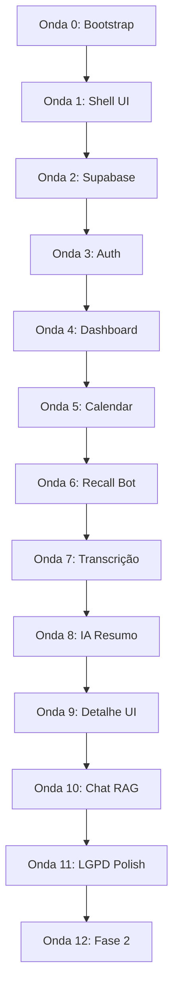
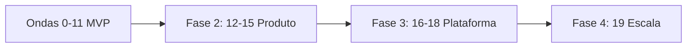
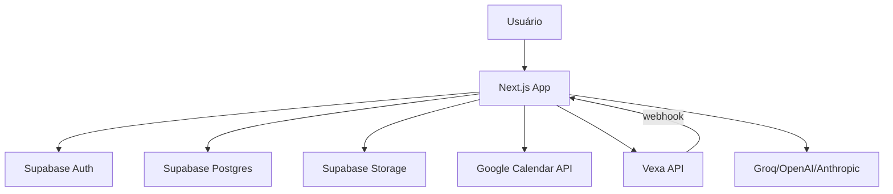

# ReuniAI — Plano de Implementação por Ondas

> SaaS individual de inteligência de reuniões (estilo Fireflies).  
> Stack: Next.js 15 · Supabase · Vexa (bot + transcrição) · LLM  
> UI: patterns de `case_agi` + design system **shadcn/ui Official** (design lab)

**Estimativa total MVP:** 6–8 semanas (1 dev experiente)  
**Última atualização:** junho 2026

### Andamento das fases

| Onda | Nome | Status |
|------|------|--------|
| 0 | Bootstrap do projeto | ✅ Concluída |
| 1 | Design system e shell UI | ✅ Concluída |
| 2 | Supabase: schema, RLS e Storage | ✅ Concluída |
| 3 | Autenticação e onboarding | ✅ Concluída |
| 4 | Dashboard e lista de reuniões | ✅ Concluída |
| 5 | Google Calendar e sync | ✅ Concluída |
| 6 | Vexa: bot nas reuniões | ✅ Concluída |
| 7 | Pipeline de transcrição | ✅ Concluída |
| 8 | IA post-call: resumo e atribuições | ✅ Concluída |
| 9 | Detalhe da reunião (UI completa) | ✅ Concluída |
| 10 | Chat com IA (RAG) | ✅ Concluída |
| 11 | Segurança, LGPD e polish | ✅ Concluída |
| 12–19 | Ondas futuras (post-MVP) | 📋 Planejadas |

---

## Índice

1. [Visão geral das ondas](#visão-geral-das-ondas)
2. [Pré-requisitos](#pré-requisitos)
3. [Onda 0 — Bootstrap do projeto](#onda-0--bootstrap-do-projeto)
4. [Onda 1 — Design system e shell UI](#onda-1--design-system-e-shell-ui)
5. [Onda 2 — Supabase: schema, RLS e Storage](#onda-2--supabase-schema-rls-e-storage)
6. [Onda 3 — Autenticação e onboarding](#onda-3--autenticação-e-onboarding)
7. [Onda 4 — Dashboard e lista de reuniões](#onda-4--dashboard-e-lista-de-reuniões)
8. [Onda 5 — Google Calendar e sync](#onda-5--google-calendar-e-sync)
9. [Onda 6 — Recall.ai: bot nas reuniões](#onda-6--recallai-bot-nas-reuniões)
10. [Onda 7 — Pipeline de transcrição](#onda-7--pipeline-de-transcrição)
11. [Onda 8 — IA post-call: resumo e atribuições](#onda-8--ia-post-call-resumo-e-atribuições)
12. [Onda 9 — Detalhe da reunião (UI completa)](#onda-9--detalhe-da-reunião-ui-completa)
13. [Onda 10 — Chat com IA (RAG)](#onda-10--chat-com-ia-rag)
14. [Onda 11 — Segurança, LGPD e polish](#onda-11--segurança-lgpd-e-polish)
15. [Ondas futuras — visão geral](#ondas-futuras--visão-geral)
16. [Onda 12 — Descoberta e organização](#onda-12--descoberta-e-organização)
17. [Onda 13 — Inteligência proativa](#onda-13--inteligência-proativa)
18. [Onda 14 — Colaboração e privacidade](#onda-14--colaboração-e-privacidade)
19. [Onda 15 — Qualidade da reunião e personalização](#onda-15--qualidade-da-reunião-e-personalização)
20. [Onda 16 — Multi-plataforma enterprise](#onda-16--multi-plataforma-enterprise)
21. [Onda 17 — Integrações e automações](#onda-17--integrações-e-automações)
22. [Onda 18 — Monetização e API](#onda-18--monetização-e-api)
23. [Onda 19 — Escala e infra própria](#onda-19--escala-e-infra-própria)
24. [Variáveis de ambiente](#variáveis-de-ambiente)
25. [Critérios de aceite do MVP](#critérios-de-aceite-do-mvp)

---

## Visão geral das ondas



| Onda | Nome | Duração | Depende de | Entrega principal |
|------|------|---------|------------|-------------------|
| 0 | Bootstrap | 1–2 dias | — | Repo Next.js rodando |
| 1 | Shell UI | 2–3 dias | 0 | AppShell + tokens shadcn |
| 2 | Supabase | 2–3 dias | 0 | Schema + RLS + Storage |
| 3 | Auth | 2–3 dias | 1, 2 | Login + onboarding |
| 4 | Dashboard | 2–3 dias | 3 | KPIs + tabela reuniões |
| 5 | Calendar | 3–5 dias | 3, 2 | Sync eventos Google |
| 6 | Recall Bot | 3–5 dias | 5 | Bot entra na call |
| 7 | Transcrição | 3–5 dias | 6 | Deepgram + segments |
| 8 | IA Resumo | 2–3 dias | 7 | Summary + action items |
| 9 | Detalhe UI | 3–4 dias | 8 | Abas completas |
| 10 | Chat RAG | 3–4 dias | 8, 9 | Chat contextual |
| 11 | LGPD Polish | 3–5 dias | 10 | MVP production-ready |
| 12–19 | Ondas futuras | contínuo | 11 | Ver seção [Ondas futuras](#ondas-futuras--visão-geral) |

---

## Pré-requisitos

### Contas e APIs (criar antes da Onda 5)

| Serviço | Uso | Quando |
|---------|-----|--------|
| [Supabase](https://supabase.com) | Auth, DB, Storage | Onda 2 |
| [Vercel](https://vercel.com) | Deploy | Onda 0 |
| [Google Cloud Console](https://console.cloud.google.com) | OAuth + Calendar API | Onda 5 |
| [Vexa](https://github.com/Vexa-ai/vexa) | Meeting bots + transcrição Whisper | Onda 6 |
| Anthropic, OpenAI ou Groq | Resumo + chat | Onda 8 |
| OpenAI (embeddings) | RAG vetorial (opcional) | Onda 8 |

### Referências locais

| Recurso | Caminho |
|---------|---------|
| UI patterns | `C:\Users\pedro\Desktop\case_agi` |
| Design tokens shadcn | `design-lab.html` → bip-ai-hub `SystemShadcn` + `lab.css` |

---

## Onda 0 — Bootstrap do projeto

**Objetivo:** Repositório funcional com dependências alinhadas ao `case_agi`.

### Tarefas

- [x] Inicializar Next.js 15 (App Router, TypeScript, Tailwind v4, `src/` ou `app/` flat)
- [x] Copiar `package.json` deps de case_agi: `next`, `react`, `tailwindcss`, `@phosphor-icons/react`, `motion`, `sonner`, `zod`, `class-variance-authority`, `clsx`, `tailwind-merge`
- [x] Adicionar `@supabase/supabase-js`, `@supabase/ssr`
- [x] Configurar `components.json` (shadcn new-york, phosphor icons)
- [x] Instalar componentes shadcn base: `button`, `card`, `input`, `label`, `tabs`, `badge`, `separator`, `skeleton`, `dialog`, `select`, `tooltip`, `sonner`
- [x] Configurar `tsconfig` paths `@/*`
- [x] Configurar ESLint (eslint-config-next)
- [x] Criar `.env.local.example` com todas as vars documentadas
- [x] Configurar `middleware.ts` placeholder para Supabase session refresh
- [x] README com setup local

### Estrutura inicial

```
reuniai/
├── app/
│   ├── layout.tsx
│   ├── globals.css
│   └── page.tsx
├── components/ui/
├── lib/utils.ts
├── supabase/          # vazio até Onda 2
├── components.json
├── package.json
├── postcss.config.mjs
├── .env.local.example
└── implementation-plan.md
```

### Critérios de aceite

- `npm run dev` sem erros
- `npm run build` passa
- Página raiz renderiza

---

## Onda 1 — Design system e shell UI

**Objetivo:** Visual shadcn neutral + navegação persistente (port de case_agi).

### Tarefas

#### 1.1 Tokens CSS (`app/globals.css`)

- [x] Portar tokens de `lab.css` `.shadcn-scope` → `:root` global
- [x] Incluir `--chart-1` … `--chart-5`
- [x] Dark mode: `[data-theme="dark"]` ou `.dark` (tokens do design lab)
- [x] `--brand` teal para ícones IA: `oklch(0.55 0.15 180)`
- [x] Utilities: `.label-caps`, `.glass`, `.nav-active` (de case_agi `globals.css`)
- [x] Geist Sans + Geist Mono via `next/font/google`

#### 1.2 Shell (`components/shell/`)

- [x] `nav-config.ts` — rotas ReuniAI + `PRODUCT` metadata
- [x] `app-shell.tsx` — sidebar 260px, header 52px, mobile drawer
- [x] Logo ReuniAI (`components/brand/reuniai-logo.tsx`)
- [x] Layout `(app)/layout.tsx` com `AppShell`

#### 1.3 Motion e layout

- [x] `components/motion/presets.ts` — `fadeUp`, easings
- [x] `components/motion/page-transition.tsx`
- [x] `components/layout/page-header.tsx`

#### 1.4 Providers

- [x] `components/providers/app-providers.tsx` (mínimo: theme se necessário)
- [x] `Toaster` em root layout

### Nav items (MVP)

| href | label | icon |
|------|-------|------|
| `/` | Visão geral | House |
| `/reunioes` | Reuniões | VideoCamera |
| `/configuracoes` | Configurações | Gear |

### Critérios de aceite

- Sidebar + header responsivos
- Navegação entre rotas placeholder funciona
- Visual idêntico ao SystemShadcn (neutral, cards com border + shadow-sm)

---

## Onda 2 — Supabase: schema, RLS e Storage

**Objetivo:** Banco completo com isolamento multi-usuário nativo.

### Tarefas

#### 2.1 Projeto Supabase

- [x] Criar projeto Supabase (região próxima — ex: South America se disponível)
- [x] Habilitar extensão `vector` (pgvector)
- [x] Configurar `supabase/config.toml` para CLI local (opcional)

#### 2.2 Migration: enums e tabelas

```sql
-- Enums
CREATE TYPE meeting_platform AS ENUM ('google_meet', 'zoom', 'teams', 'other');
CREATE TYPE meeting_status AS ENUM (
  'scheduled', 'bot_joining', 'recording', 'processing',
  'completed', 'failed', 'cancelled', 'partial'
);
CREATE TYPE action_item_status AS ENUM ('open', 'done', 'cancelled');
CREATE TYPE calendar_provider AS ENUM ('google', 'outlook');
```

**Tabelas:**

| Tabela | Colunas principais |
|--------|-------------------|
| `profiles` | `id` (FK auth.users), `display_name`, `auto_join_enabled`, `retention_days`, `onboarding_completed`, `created_at` |
| `calendar_connections` | `id`, `user_id`, `provider`, `email`, `refresh_token_encrypted`, `sync_token`, `last_synced_at` |
| `meetings` | `id`, `user_id`, `calendar_event_id`, `title`, `started_at`, `ended_at`, `platform`, `meeting_url`, `status`, `recall_bot_id`, `duration_ms`, `recording_path`, `error_message` |
| `participants` | `id`, `meeting_id`, `name`, `email` |
| `transcript_segments` | `id`, `meeting_id`, `start_ms`, `end_ms`, `speaker_label`, `text`, `sequence` |
| `meeting_summaries` | `id`, `meeting_id`, `executive_summary`, `topics` (jsonb), `decisions` (jsonb), `raw_json` (jsonb) |
| `action_items` | `id`, `meeting_id`, `user_id`, `title`, `assignee`, `due_date`, `status`, `source` ('ai' \| 'manual') |
| `chat_messages` | `id`, `meeting_id`, `user_id`, `role`, `content`, `citations` (jsonb) |
| `transcript_embeddings` | `id`, `segment_id`, `meeting_id`, `embedding` vector(1536) |
| `webhook_events` | `id`, `provider`, `event_id`, `payload` (jsonb), `processed_at` — idempotência |

#### 2.3 RLS policies

- [x] `profiles`: user só acessa `id = auth.uid()`
- [x] Todas as tabelas com `user_id`: policy `auth.uid() = user_id`
- [x] `participants`, `transcript_segments`, etc.: via join `meetings.user_id = auth.uid()`
- [x] Trigger `on_auth_user_created` → insert `profiles`

#### 2.4 Storage

- [x] Bucket `recordings` — **private**
- [x] Policy SELECT/INSERT/DELETE: `(storage.foldername(name))[1] = auth.uid()::text`
- [x] Path convention: `{user_id}/{meeting_id}/recording.mp4`

#### 2.5 Client Supabase

- [x] `lib/supabase/client.ts` — browser client
- [x] `lib/supabase/server.ts` — server component / route handler
- [x] `lib/supabase/middleware.ts` — session refresh
- [x] `lib/supabase/admin.ts` — service role (só importar em `app/api/`)
- [x] `npm run gen:types` → `lib/supabase/database.types.ts`

### Critérios de aceite

- Migrations aplicam sem erro
- Usuário A não pode SELECT meetings de usuário B (testar manualmente ou script)
- Upload teste no bucket respeita RLS

---

## Onda 3 — Autenticação e onboarding

**Objetivo:** Usuários podem criar conta, logar e completar setup inicial.

### Tarefas

#### 3.1 Auth pages (`app/(auth)/`)

- [x] `/login` — email + senha + Google OAuth
- [x] `/signup` — email + senha + confirmação
- [x] `/auth/callback` — route handler Supabase OAuth
- [x] Redirect: não autenticado → `/login`; autenticado em `/login` → `/`

#### 3.2 Middleware

- [x] Proteger rotas `(app)/*` exceto auth e webhooks
- [x] Refresh session em cada request

#### 3.3 Onboarding (`app/(onboarding)/onboarding/`)

- [x] Fluxo em steps (boas-vindas, LGPD, auto-join, calendário skip)
- [x] Ao completar: `profiles.onboarding_completed = true`

#### 3.4 Settings base

- [x] `/configuracoes` com e-mail e auto-join
- [x] Botão logout
- [x] Link deletar conta (stub até Onda 11)

### Critérios de aceite

- Signup → login → onboarding → dashboard (shell vazio)
- Session persiste após refresh
- Google OAuth funciona em produção (Vercel)

---

## Onda 4 — Dashboard e lista de reuniões

**Objetivo:** UI principal com dados mock; depois plugar Supabase real.

### Tarefas

#### 4.1 Dashboard (`app/(app)/page.tsx`)

Layout SystemShadcn (4 KPI cards + grid):

| KPI | Valor exemplo | Detalhe |
|-----|---------------|---------|
| Reuniões este mês | `12` | +2 vs mês anterior |
| Horas gravadas | `8.5h` | Total processado |
| Action items abertos | `5` | Pendentes |
| Próxima reunião | `14:00` | Título do evento |

- [x] `components/dashboard/kpi-cards.tsx`
- [x] `components/dashboard/recent-meetings-table.tsx` — colunas: título, data, plataforma, status, duração
- [x] `components/dashboard/attention-card.tsx` — action items vencidos/próximos
- [ ] `components/dashboard/meetings-chart.tsx` — reuniões por semana (recharts, opcional MVP — adiado)

#### 4.2 Lista de reuniões (`app/(app)/reunioes/page.tsx`)

- [x] Data table com sort por data
- [x] Filtros: status, plataforma, busca por título
- [x] Badge de status com cores (scheduled=muted, recording=warning, completed=success, failed=destructive)
- [x] Link row → `/reunioes/[id]`

#### 4.3 Data layer

- [x] `lib/meetings/queries.ts` — `getMeetingsForUser`, `getMeetingById`, stats do dashboard
- [x] Server Components fetching Supabase (seed opcional via `npm run db:seed`)
- [x] `lib/meetings/types.ts` + helpers de formatação e labels

#### 4.4 Status badges

```typescript
const STATUS_LABELS: Record<MeetingStatus, string> = {
  scheduled: 'Agendada',
  bot_joining: 'Bot entrando',
  recording: 'Gravando',
  processing: 'Processando',
  completed: 'Concluída',
  failed: 'Falhou',
  cancelled: 'Cancelada',
  partial: 'Parcial',
};
```

### Critérios de aceite

- Dashboard renderiza com 0 reuniões (empty state elegante)
- Seed script opcional popula 5 reuniões mock para dev
- Tabela pagina ou limita a 50 items

---

## Onda 5 — Google Calendar e sync

**Objetivo:** Ler eventos do calendário, detectar links de reunião, criar registros `meetings`.

### Tarefas

#### 5.1 Google Cloud setup

- [ ] Projeto GCP com Calendar API habilitada
- [ ] OAuth credentials (Web application)
- [ ] Scopes: `https://www.googleapis.com/auth/calendar.readonly`
- [ ] Redirect URI: `{APP_URL}/api/calendar/callback`

#### 5.2 OAuth flow

- [x] `GET /api/calendar/connect` — redirect Google OAuth
- [x] `GET /api/calendar/callback` — recebe tokens, salva em `calendar_connections`
- [x] Encrypt refresh_token antes de salvar (`lib/crypto/token-encrypt.ts` — AES-256-GCM com `ENCRYPTION_KEY` env)

#### 5.3 Sync job

- [x] `POST /api/calendar/sync` — manual trigger (botão em configurações)
- [x] Cron Vercel `/api/cron/calendar-sync` — cada 15 min (proteger com `CRON_SECRET`)
- [x] `lib/calendar/google.ts`:
  - Listar eventos próximos 7 dias + passados 30 dias
  - Extrair URL de meeting (regex Meet/Zoom/Teams)
  - Upsert `meetings` por `calendar_event_id`
  - Detectar `platform` enum

#### 5.4 Detecção de plataforma

```typescript
function detectPlatform(url: string): MeetingPlatform {
  if (url.includes('meet.google.com')) return 'google_meet';
  if (url.includes('zoom.us')) return 'zoom';
  if (url.includes('teams.microsoft.com') || url.includes('teams.live.com')) return 'teams';
  return 'other';
}
```

#### 5.5 UI configurações

- [x] Card "Google Calendar" — conectado/desconectado, email, último sync
- [x] Botão "Sincronizar agora"
- [x] Toggle auto-join (salva em `profiles`)

### Critérios de aceite

- Conectar calendário → eventos com link aparecem em `/reunioes` com status `scheduled`
- Re-sync não duplica meetings (unique constraint `user_id + calendar_event_id`)
- Desconectar remove connection (não meetings históricas)

---

## Onda 6 — Vexa: bot nas reuniões ✅

**Objetivo:** Bot ReuniAI entra (manual ou automaticamente) nas reuniões e grava/transcreve.

> **Decisão:** trocamos Recall.ai pelo **[Vexa](https://github.com/Vexa-ai/vexa)** — alternativa open-source (Apache 2.0). API quase idêntica (POST URL → GET transcript) e que já cobre gravação **e** transcrição (Whisper). Modo **cloud** (`https://api.cloud.vexa.ai`, $5 grátis) para validar agora; mesmo código migra para **self-hosted** (`http://localhost:8056`, custo zero) trocando só `VEXA_API_BASE`.

### Tarefas

#### 6.1 Setup ✅

- [x] Env: `VEXA_API_BASE`, `VEXA_API_KEY`, `VEXA_WEBHOOK_SECRET`, `NEXT_PUBLIC_BOT_NAME`
- [x] Registrar webhook (público): `npm run vexa:webhook -- https://seu-dominio.com` → `scripts/vexa-set-webhook.mjs`

#### 6.2 Client Vexa (`lib/vexa/client.ts`) ✅

- [x] `createBot({ platform, nativeMeetingId, ... })` — recording + transcribe realtime
- [x] `stopBot(platform, nativeMeetingId)` (idempotente em 404)
- [x] `getRunningBots()` / `getTranscript()` / `setUserWebhook()`
- [x] `lib/meetings/meeting-url.ts` — parse plataforma + `native_meeting_id` (Meet/Zoom)

#### 6.3 Scheduler ✅

- [x] `lib/vexa/scheduler.ts` — `startBotForMeeting()` + `scheduleBotsForUpcomingMeetings()` (janela: 5 min antes, 2 h de tolerância; só usuários com `auto_join_enabled`)
- [x] Cron `/api/cron/schedule-bots` — cada 5 min (protegido por `CRON_SECRET`)
- [x] Update meeting: `status = bot_joining`, `recall_bot_id = native_meeting_id`

#### 6.4 Webhook handler (`app/api/webhooks/vexa/route.ts`) ✅

Mapeamento `meeting.status_change`:

| Status Vexa | Status interno |
|-------------|----------------|
| `requested` / `joining` / `awaiting_admission` | `bot_joining` |
| `active` | `recording` |
| `completed` | `completed` (+ `ended_at`, `duration_ms`) |
| `failed` | `failed` (+ `error_message`) |

- [x] Idempotência via `webhook_events` (provider `vexa` + `event_id`)
- [x] Auth via `Authorization: Bearer <VEXA_WEBHOOK_SECRET>`
- [x] Service role para updates (`lib/vexa/sync.ts`)
- [x] `recording.completed` → ingestão de transcript fica para Onda 7

#### 6.5 Fallback de status + UI ✅

- [x] Cron `/api/cron/poll-bots` — fallback sem webhook público (localhost): consulta `getRunningBots()` e fecha reuniões encerradas
- [x] Rotas manuais `/api/bots/start` e `/api/bots/stop` (autenticadas)
- [x] UI: `components/meetings/bot-actions.tsx` na tabela (Enviar bot / Parar bot)

#### 6.6 Bot branding ✅

- [x] Nome configurável via `NEXT_PUBLIC_BOT_NAME` (default `ReuniAI Bot`)
- [x] Página pública `/recording-notice` (aviso LGPD), liberada no middleware

### Critérios de aceite

- [x] Bot enviado manualmente entra na call (botão na tabela de reuniões)
- [x] Status atualiza via webhook (prod) ou poll (`/api/cron/poll-bots`, local)
- [x] Webhooks/crons públicos sem redirect de sessão; demais rotas protegidas

> **Pendente do usuário:** preencher `VEXA_API_KEY` (vexa.ai/account, $5 grátis) para testar.

### ⚠️ Crédito grátis e plano de migração para custo zero

**Situação atual (cloud):**

- Estamos usando o **Vexa Cloud** (`VEXA_API_BASE=https://api.cloud.vexa.ai`).
- O crédito grátis é de **$5 por conta** (~16h de bot a $0,30/h). **Não é recorrente** — depois disso vira pago ($0,30/h de bot + $0,20/h de transcrição realtime).
- Os dados (áudio/transcrição) passam pela infraestrutura do Vexa enquanto estivermos no cloud.

**Pontos a resolver / dúvidas em aberto:**

- [ ] Confirmar quanto do crédito de $5 já foi consumido (dashboard em vexa.ai/account).
- [ ] Definir gatilho de migração: migrar **antes** do crédito acabar para não interromper o serviço.
- [ ] Validar requisitos do self-hosted (Vexa precisa de Docker em Linux; transcrição Whisper pede CPU/RAM razoável ou GPU para realtime).

**Plano de migração (substituir cloud por custo zero):**

1. **Opção A — Docker local:** subir o Vexa com `make lite` (container único) na própria máquina/servidor. Bom para dev e volume baixo.
2. **Opção B — VM grátis:** hospedar o Vexa numa VM de free tier (ex.: Oracle Cloud Always Free, e2-micro do GCP, ou similar) com Docker. Precisa ser **Linux sempre disponível** no horário das reuniões.
3. **Troca no código:** mudar apenas `VEXA_API_BASE` para `http://localhost:8056` (ou o IP/host da VM). **Nenhuma outra alteração de código é necessária** — client, scheduler, webhook e poll já são agnósticos.
4. **Webhook:** rodar `npm run vexa:webhook -- <URL pública>` apontando para o app; no self-hosted local sem URL pública, continuar usando o fallback `/api/cron/poll-bots`.
5. **Transcrição:** no self-hosted, é possível usar Whisper local (sem custo de API) — fecha o ciclo de custo zero também na Onda 7.

> **Decisão registrada:** começar no cloud (rápido, $5 grátis para validar) e **substituir posteriormente por VM grátis ou Docker local** assim que o fluxo estiver validado, mantendo o mesmo código.

---

## Onda 7 — Pipeline de transcrição ✅

**Objetivo:** Transcrição da reunião com timestamps e speakers, exibida na UI.

> **Decisão:** o Vexa já transcreve via Whisper (100+ idiomas, com diarização). Em vez de baixar a gravação e mandar para o Deepgram, **buscamos os segmentos prontos** em `GET /transcripts/{platform}/{id}` e persistimos. Custo de transcrição = $0 no self-hosted (Whisper local). Deepgram foi removido do escopo.

### Tarefas

#### 7.1 Ingestão (`lib/pipeline/ingest-transcript.ts`) ✅

- [x] `ingestMeetingTranscript()` — busca transcript no Vexa, converte tempos (s → ms), persiste em `transcript_segments`
- [x] Idempotente: `delete` + `insert` por `meeting_id`; `sequence` reordenada
- [x] Status: `processing` → `completed` (com trechos) ou `partial` (sem trechos)
- [x] `ingestByNativeId()` — resolve a reunião via `recall_bot_id` e ingere

#### 7.2 Gatilhos ✅

- [x] Webhook (`recording.completed` ou status `completed`) → ingestão automática
- [x] Cron `/api/cron/poll-bots` (fallback local) → ingere ao detectar reunião encerrada
- [x] Rota manual `POST /api/bots/transcript` (autenticada) para re-buscar sob demanda

#### 7.3 Query + helpers ✅

- [x] `lib/meetings/transcript.ts` — `getTranscriptSegments()` + `formatTimestamp(ms)`

#### 7.4 UI ✅

- [x] `components/meetings/transcript-view.tsx` — lista de segments com timestamp mono e badge de speaker (cor por participante)
- [x] `app/(app)/reunioes/[id]/page.tsx` — página de detalhe (header, status, plataforma, transcrição)
- [x] `components/meetings/transcript-sync-button.tsx` — botão "Buscar transcrição"

> **Diferido para Onda 9:** player de gravação com seek (Vexa serve a mídia autenticada via `/recordings/...`; exige rota proxy) e highlight do segment ativo via `onSeek(ms)`.

### Critérios de aceite

- [x] Reunião encerrada gera segments no DB (via webhook/poll ou botão manual)
- [x] Transcrição visível na página de detalhe com timestamp e speaker
- [x] Ingestão idempotente (re-buscar não duplica trechos)

---

## Onda 8 — IA post-call: resumo e atribuições ✅

**Objetivo:** Extrair valor automaticamente da transcrição.

> **Multi-provedor:** o LLM é selecionável por `LLM_PROVIDER` (**groq** | openai | anthropic). Se vazio, usa o primeiro com chave (ordem groq > openai > anthropic). Groq e OpenAI compartilham o mesmo caminho (API compatível, `response_format: json_object`); Anthropic tem caminho próprio. Default sugerido: **Groq** (free tier, rápido).

### Tarefas

#### 8.1 LLM client (`lib/llm/client.ts`) ✅

- [x] Multi-provedor: Groq/OpenAI (compatível) + Anthropic
- [x] `generateJson({ system, user })` com timeout 60s (AbortController)
- [x] `getLlmProvider()` / `isLlmConfigured()` (resolução por env/chave)
- [x] `extractJson()` tolerante a cercas markdown

#### 8.2 Schema de resumo (Zod) ✅

- [x] `lib/llm/meeting-analysis.ts` — `MeetingAnalysisSchema` (executive_summary, topics, decisions, action_items) com defaults

#### 8.3 Prompt engineering ✅

- [x] System PT-BR: "não invente informações; datas ISO só quando explícitas"
- [x] Transcript truncado defensivamente (>100k chars)
- [x] `PROMPT_VERSION = v1` (auditoria)

#### 8.4 Persist (`lib/pipeline/analyze-meeting.ts`) ✅

- [x] Upsert `meeting_summaries` (por `meeting_id`)
- [x] Recria `action_items` `source = 'ai'` (preserva os manuais)
- [x] `status = completed`; em falha → `failed` + `error_message`
- [x] Pipeline `lib/pipeline/process-meeting.ts` (ingestão → análise), disparada em webhook/poll/rota manual
- [x] No-op silencioso se nenhum provedor estiver configurado (não quebra o fluxo)

#### 8.5 Embeddings (prep para Onda 10) ✅

- [x] `lib/embeddings/generate.ts` — `text-embedding-3-small` (OpenAI), batelado por segmento
- [x] Insert `transcript_embeddings` (idempotente por reunião)
- [x] **Opcional**: só roda se `EMBEDDINGS_API_KEY` existir; não bloqueia a análise (Groq não tem embeddings)

#### 8.6 UI (parcial — completa na Onda 9) ✅

- [x] `components/meetings/summary-view.tsx` — resumo executivo, tópicos e decisões
- [x] `components/meetings/action-items-list.tsx` — lista (read-only por enquanto)
- [x] Integrado em `app/(app)/reunioes/[id]/page.tsx`

### Critérios de aceite

- [x] Reunião com transcript → summary + action items no DB
- [x] Resumo em PT-BR coerente; provedor trocável por env
- [x] Falha LLM → `status = failed` com mensagem, sem corromper dados
- [x] Funciona só com Groq (embeddings desligados automaticamente)

---

## Onda 9 — Detalhe da reunião (UI completa) ✅

**Objetivo:** Página `/reunioes/[id]` com todas as abas funcionais.

### Tarefas

#### 9.1 Layout (`app/(app)/reunioes/[id]/page.tsx`) ✅

- [x] `PageHeader` — título, data, duração, badges de status/plataforma, link da call
- [x] Tabs (`components/meetings/meeting-tabs.tsx`): Resumo | Atribuições | Transcrição | Chat
- [x] Badge com contagem de itens em aberto na aba Atribuições

#### 9.2 Aba Resumo ✅

- [x] `components/meetings/summary-view.tsx` (Onda 8) — resumo executivo em card, tópicos e decisões

#### 9.3 Aba Transcrição ✅ (parcial)

- [x] `components/meetings/transcript-view.tsx` — segments com timestamp e speaker
- [ ] **Diferido:** player de áudio com highlight do segment ativo (exige rota proxy para a mídia autenticada do Vexa — `GET /recordings/...`). Pendente de validar os endpoints de gravação do Vexa.

#### 9.4 Aba Atribuições (`components/meetings/action-items-tab.tsx`) ✅

- [x] Lista com checkbox (toggle `done`, otimista)
- [x] Editar título, assignee e due_date inline
- [x] Adicionar item manual (`source = manual`)
- [x] Deletar item

#### 9.5 API mutations ✅

- [x] `POST /api/meetings/[id]/action-items` (criar, Zod)
- [x] `PATCH /api/meetings/[id]/action-items/[itemId]` (editar/toggle, Zod)
- [x] `DELETE /api/meetings/[id]/action-items/[itemId]`
- [x] Ownership: verifica `meeting.user_id`/`item.user_id` antes de gravar (admin client)

#### 9.6 Empty e loading states ✅

- [x] `components/meetings/meeting-status-banner.tsx` — info enquanto `processing`/`recording`/`bot_joining`
- [x] Mensagem clara para `failed` com `error_message`
- [x] `partial` — "transcrição parcial disponível"
- [x] Empty states nas abas (resumo, transcrição e atribuições)

### Critérios de aceite

- [x] Abas funcionam com dados reais
- [x] Edição/criação/remoção de action item persiste (refletirá no "attention card" do dashboard)
- [x] Tabs com `flex-wrap` (responsivo)
- [ ] Player responsivo — diferido junto com 9.3

---

## Onda 10 — Chat com IA (RAG) ✅

**Objetivo:** Perguntar sobre a reunião com respostas citando timestamps.

> **RAG sem migração:** quando há `EMBEDDINGS_API_KEY`, a busca vetorial roda **em memória** (cosseno em Node sobre os embeddings da reunião) — sem precisar de RPC/pgvector query. Sem chave de embeddings (caso Groq), o contexto é a **transcrição completa** (truncada por orçamento). Em ambos os casos o LLM cita trechos por número e mapeamos para `{ start_ms, text }`.

### Tarefas

#### 10.1 UI do chat ✅

- [x] `components/ia/meeting-chat.tsx` — lista de mensagens, input, estado "Pensando…"
- [x] Prompts sugeridos embutidos (`MEETING_PROMPTS`)
- [x] Bolhas com citações clicáveis

#### 10.2 Suggested prompts ✅

- [x] "Quais foram as decisões tomadas?", "Liste todos os itens de ação", "Resuma em 3 bullet points", "O que ficou pendente?"

#### 10.3 RAG (`lib/rag/meeting-context.ts`) ✅

- [x] `buildMeetingContext()` — resumo executivo + trechos relevantes
- [x] Busca vetorial em memória (top-8 por cosseno) quando há embeddings
- [x] Fallback para transcrição completa truncada (sem embeddings)
- [x] `embedQuery` / `cosineSimilarity` / `parseVector` em `lib/embeddings/generate.ts`

#### 10.4 API (`POST /api/meetings/[id]/chat`) ✅

- [x] Valida ownership do meeting
- [x] Rate limit 20 req/min/usuário (in-memory)
- [x] Persist `chat_messages` (user + assistant) via admin
- [x] Resposta: `{ content, citations: [{ start_ms, text }] }`
- [x] 503 se nenhum provedor de IA configurado

#### 10.5 Citações na UI ✅

- [x] Chips "02:34" abaixo da resposta
- [x] Click → toast com o texto do trecho (seek do player virá com o player diferido)

### Critérios de aceite

- [x] "Quais itens de ação?" retorna lista coerente com a transcrição
- [x] Citações apontam timestamps reais dos trechos usados
- [x] Chat é escopado por reunião (contexto só daquela reunião)
- [x] Histórico de chat persiste ao recarregar (carregado no server)

---

## Onda 11 — Segurança, LGPD e polish

**Objetivo:** MVP production-ready.

### Tarefas

#### 11.1 Delete completo

- [x] `DELETE /api/meetings/[id]` — segments, summary, action_items, embeddings, chat, Storage file, meeting row
- [x] `DELETE /api/account` — todas meetings + calendar_connection + profile + auth.users (service role)
- [x] UI confirmação com digitar "DELETAR"

#### 11.2 Retenção automática

- [x] Cron `/api/cron/retention` — deletar meetings > `profiles.retention_days`
- [x] Default 365 dias

#### 11.3 Busca

- [x] Busca full-text em título + transcript (`ILIKE` ou `tsvector` — simples primeiro)
- [x] Input no header ou `/reunioes?q=`

#### 11.4 Export

- [x] `GET /api/meetings/[id]/export?format=md`
- [x] Markdown: título, resumo, action items, transcript completo

#### 11.5 Email digest (opcional MVP)

- [ ] Resend ou Supabase Edge + template HTML
- [ ] Após `status = completed`, email com resumo + link

#### 11.6 Dark mode

- [x] Toggle em configurações
- [x] `data-theme="dark"` no `<html>`
- [x] Tokens dark do design lab

#### 11.7 Testes de isolamento

- [x] Script ou teste: user A cria meeting, user B GET `/api/meetings/{id}` → 404
- [x] Storage: user B não acessa signed URL de user A (ver `supabase/tests/rls_isolation_notes.sql`)

#### 11.8 Error monitoring

- [x] Structured logging em webhooks
- [ ] Sentry ou Vercel Analytics (opcional)

#### 11.9 Performance

- [x] Índices: `meetings(user_id, started_at)`, `transcript_segments(meeting_id, sequence)`
- [x] Paginação cursor-based na lista de reuniões

### Critérios de aceite

- Checklist LGPD: consentimento, delete, retenção, gravações privadas
- Build produção sem warnings
- Lighthouse performance > 80 na dashboard

---

## Ondas futuras — visão geral

As ondas 0–11 entregam o **MVP monetizável**. As ondas 12–19 expandem valor, integrações e escala — **não bloqueiam o launch**. Priorizar por feedback de usuários e custo operacional.



| Onda | Fase | Tema | Prioridade sugerida |
|------|------|------|---------------------|
| 12 | Produto | Descoberta e organização | Alta — retorno imediato após MVP |
| 13 | Produto | Inteligência proativa | Alta — diferencial vs Fireflies |
| 14 | Produto | Colaboração e privacidade | Média — antes de share público |
| 15 | Produto | Qualidade e personalização | Média — polish de IA |
| 16 | Plataforma | Multi-plataforma enterprise | Média — Outlook/Teams nativo |
| 17 | Plataforma | Integrações | Média — workflow do usuário |
| 18 | Plataforma | Monetização e API | Alta — quando houver usuários pagantes |
| 19 | Escala | Infra própria | Baixa — só com volume/custo |

**Features recomendadas originalmente** (distribuídas nas ondas abaixo):

| Feature | Onda |
|---------|------|
| Meeting Prep | 13 |
| Follow-up draft | 13 |
| Detecção de compromissos | 13 |
| Highlight bookmarks | 15 |
| Talk-time analytics | 15 |
| PT-BR default + multi-idioma | 15 |

**Quatro features novas recomendadas:**

| Feature | Onda | Por quê |
|---------|------|---------|
| Séries de reuniões recorrentes | 12 | Standups semanais são o caso de uso #1; contexto entre ocorrências |
| Mapeamento persistente de speakers | 15 | Diarização genérica ("Speaker 1") frustra; nomes reais aumentam confiança |
| Redação de PII no share/export | 14 | LGPD + share seguro sem vazar dados sensíveis falados na call |
| Templates de análise por tipo de reunião | 15 | Standup ≠ vendas ≠ 1:1; resumos genéricos perdem precisão |

---

## Onda 12 — Descoberta e organização

**Objetivo:** Encontrar e organizar reuniões quando a biblioteca cresce (50+ calls).

**Estimativa:** 1–2 semanas  
**Depende de:** Onda 11 (MVP), embeddings da Onda 8

### Features

#### 12.1 Busca semântica global

- Perguntas em linguagem natural em **todas** as reuniões: "o que decidimos sobre pricing?"
- `pgvector` cross-meeting: embed query → top segments de qualquer `meeting_id` do usuário
- UI: barra de busca no header → página `/busca` com resultados agrupados por reunião + snippet + link ao timestamp
- Fallback full-text (`tsvector`) para título e participantes

#### 12.2 Tags e pastas

- Tabelas: `tags`, `meeting_tags`; pastas opcionais `folders` com `parent_id`
- UI: multi-select tags na lista; filtro por tag/pasta
- Auto-tag por IA (opcional): LLM sugere 2–3 tags após processamento

#### 12.3 Séries de reuniões recorrentes *(nova)*

- Agrupar por `calendar_recurring_event_id` do Google Calendar
- Página `/series/[id]` — timeline de todas as ocorrências
- Card na dashboard: "Sua série Weekly Sync — 8 reuniões"
- Chat scoped à série: "o que mudou nas últimas 3 semanas?"
- Evolução de tópicos: diff automático entre resumos consecutivos

#### 12.4 Filtros avançados na lista

- Por participante (email), plataforma, duração, presença de action items abertos
- Salvar filtros como "vistas" (`saved_views` jsonb em `profiles`)

### Critérios de aceite

- Busca retorna resultado relevante em < 2s com 100 reuniões seed
- Série recorrente agrupa 4+ ocorrências automaticamente
- Tags persistem e filtram corretamente

---

## Onda 13 — Inteligência proativa

**Objetivo:** IA que age **antes e depois** da reunião, não só durante a revisão.

**Estimativa:** 1–2 semanas  
**Depende de:** Onda 5 (calendar), Onda 8 (summaries)

### Features

#### 13.1 Meeting Prep

- Cron 5 min antes de `started_at`: se há participantes em comum com reuniões anteriores
- Gera briefing: decisões pendentes, action items abertos, resumo da última call com o mesmo grupo
- Entrega: notificação in-app + email opcional + card na home "Próxima: Weekly Sync em 5 min"
- Link direto ao histórico da série (Onda 12.3)

#### 13.2 Follow-up draft

- Após `status = completed`: LLM gera email de follow-up em PT-BR
- Estrutura: agradecimento, decisões, action items com responsáveis, próximos passos
- UI: aba ou modal "Copiar email" + editar antes de enviar (não envia automaticamente no MVP desta onda)

#### 13.3 Detecção de compromissos

- Segunda passada LLM no transcript: frases com compromisso temporal ("mando na sexta", "até amanhã")
- Sugere `action_items` com `due_date` inferida + badge "Sugerido pela IA"
- Usuário aceita/rejeita em batch na aba Atribuições

#### 13.4 Digest semanal

- Email resumo: N reuniões, top decisões, action items vencendo, horas gravadas
- Cron domingo 8h (timezone do usuário em `profiles`)

### Critérios de aceite

- Prep aparece para reunião com histórico de participantes em comum
- Follow-up coerente com action items do DB
- Compromisso "envio o relatório na sexta" gera sugestão com data

---

## Onda 14 — Colaboração e privacidade

**Objetivo:** Compartilhar insights com segurança; ampliar alcance sem data leak.

**Estimativa:** 1–2 semanas  
**Depende de:** Onda 11 (LGPD base)

### Features

#### 14.1 Share links read-only

- `share_tokens` table: `meeting_id`, `token`, `expires_at`, `scopes` (summary_only | full_transcript)
- URL pública `/s/[token]` — sem login, layout simplificado sem sidebar
- Revogar link em configurações da reunião

#### 14.2 Export avançado

- PDF formatado (resumo + action items + transcript paginado)
- Markdown (já no MVP Onda 11) + JSON estruturado para integrações

#### 14.3 Redação de PII *(nova)*

- Antes de share/export: scan LLM + regex para emails, telefones, CPF/CNPJ, cartões, senhas faladas
- UI toggle: "Redigir dados sensíveis" (default **on** para share links)
- Substituir com `[REDACTED]` no texto exportado; gravação original intacta no Storage
- Log de redações em `export_audit` para compliance

#### 14.4 Comentários internos (leve)

- `meeting_comments` — notas do usuário em timestamp específico
- Não é colaboração multi-user no SaaS individual; é anotação pessoal na timeline

### Critérios de aceite

- Link expirado retorna 404
- Export com redação não contém CPF de teste inserido no transcript
- PDF abre e é legível

---

## Onda 15 — Qualidade da reunião e personalização

**Objetivo:** Transcrição e resumos mais úteis; métricas de eficiência da call.

**Estimativa:** 1–2 semanas  
**Depende de:** Onda 7 (segments), Onda 8 (summary)

### Features

#### 15.1 Talk-time analytics

- Agregar `transcript_segments` por `speaker_label`: % tempo de fala, palavras, turnos
- UI: bar chart na aba Resumo ou card dedicado
- Útil para coaching, reuniões desbalanceadas, standups

#### 15.2 Highlight bookmarks

- `meeting_highlights`: `meeting_id`, `start_ms`, `end_ms`, `label`, `created_by`
- UI: botão "Marcar momento" no player + lista de highlights clicáveis
- Export inclui seção "Momentos marcados"

#### 15.3 Mapeamento persistente de speakers *(nova)*

- UI após primeira reunião: "Speaker 1 → Pedro", "Speaker 2 → Maria"
- `speaker_mappings`: `user_id`, `participant_email` ou `label_pattern`, `display_name`
- Pipeline reprocessa labels em segments futuros quando email do participante coincide
- Heurística: primeiro speaker ≈ host quando metadata do Recall disponível

#### 15.4 Templates de análise por tipo *(nova)*

- `analysis_templates`: standup, vendas, 1:1, retrospectiva, genérico
- Usuário escolhe template na reunião ou auto-detect por título do calendário ("Daily", "Demo")
- Cada template: system prompt diferente + schema Zod (ex: standup → blockers + yesterday + today)
- Settings: template default por série recorrente

#### 15.5 Multi-idioma na transcrição

- Deepgram `detect_language` ou hint por `profiles.locale`
- PT-BR default; EN, ES como opções
- Resumo sempre no idioma preferido do usuário

### Critérios de aceite

- Talk-time soma ~100% da duração falada
- Template standup não gera seção "decisões de pricing"
- Speaker mapping persiste na segunda reunião com mesmos participantes

---

## Onda 16 — Multi-plataforma enterprise

**Objetivo:** Outlook, Teams nativo, Meet Workspace — para usuários que já gravam na plataforma.

**Estimativa:** 2–3 semanas  
**Depende de:** Onda 5 (calendar patterns)

### Features

#### 16.1 Outlook Calendar

- Microsoft Graph OAuth + sync paralelo ao Google
- `calendar_connections.provider = outlook`

#### 16.2 Teams native transcripts

- Graph API: `onlineMeetings/transcripts` quando organizador tem Teams Premium/Enterprise
- Modo "bring your own recording": webhook quando transcript disponível → ingest sem bot
- Reduz custo Recall para clientes enterprise

#### 16.3 Google Meet REST artifacts

- Meet API: `conferenceRecords/transcripts` para Workspace com gravação nativa
- Fallback chain: bot Recall → artifact nativo → falha com mensagem clara

#### 16.4 PWA + notificações push *(nova — 5ª feature extra)*

- `next-pwa` ou manifest manual; service worker para cache de shell
- Push quando `status = completed` ou Meeting Prep disponível
- Instalar no celular para revisar reunião no commute

> Nota: a 5ª feature extra (PWA) complementa Meeting Prep e digest — notificações no momento certo.

### Critérios de aceite

- Usuário Outlook vê eventos em `/reunioes`
- Transcript Teams importado sem bot na call
- PWA instalável no Chrome mobile

---

## Onda 17 — Integrações e automações

**Objetivo:** ReuniAI no fluxo de trabalho existente do usuário.

**Estimativa:** 2 semanas  
**Depende de:** Onda 8 (action items), Onda 14 (export)

### Features

#### 17.1 Slack

- Post-meeting digest no canal escolhido (Block Kit: resumo + action items)
- OAuth Slack; settings por workspace Slack do usuário

#### 17.2 Notion

- Export página Notion: resumo + transcript colapsável + checklist action items
- OAuth Notion API

#### 17.3 Webhooks outbound

- Usuário registra URL + secret
- Eventos: `meeting.completed`, `action_item.created`
- HMAC signature; retry 3x

#### 17.4 Zapier / Make (via webhooks)

- Documentação OpenAPI mínima para triggers

#### 17.5 Comparador de reuniões *(nova — 6ª feature extra)*

- UI side-by-side ou `/compare?a=&b=`
- LLM gera "o que mudou" entre duas ocorrências da mesma série
- Diff de action items: resolvidos vs novos

### Critérios de aceite

- Slack recebe mensagem após reunião de teste
- Webhook entrega payload válido com signature verificável

---

## Onda 18 — Monetização e API

**Objetivo:** SaaS sustentável + ecossistema.

**Estimativa:** 2–3 semanas  
**Depende de:** Onda 11 (produção estável)

### Features

#### 18.1 Stripe billing

- Tiers: Free (60 min/mês), Pro (500 min), Unlimited
- Metering: `usage_minutes` agregado por `user_id` mensal
- Portal Stripe para upgrade/cancel
- Hard stop ou aviso quando limite atingido (bot não entra)

#### 18.2 API pública REST

- API keys em `api_keys` table com scopes
- Endpoints: list meetings, get transcript, get summary, search
- Rate limit por key

#### 18.3 MCP server *(nova — 7ª feature extra)*

- Model Context Protocol para Cursor/Claude Desktop
- Tools: `search_meetings`, `get_meeting_summary`, `list_action_items`
- Diferencial forte para devs e power users

#### 18.4 Dark mode

- Se não entregue na Onda 11: tokens dark do design lab + toggle persistente

### Critérios de aceite

- Upgrade Pro via Stripe reflete limite imediatamente
- API key lista meetings do owner apenas
- MCP tool retorna resumo de reunião de teste

---

## Onda 19 — Escala e infra própria

**Objetivo:** Reduzir custo por minuto e suportar volume; só quando Recall custo > benefício.

**Estimativa:** 3–6 meses (projeto paralelo)  
**Depende de:** Onda 18 (receita para justificar)

### Features

#### 19.1 Bots self-hosted

- Zoom Meeting SDK em containers Linux (K8s ou Fly Machines)
- Pool regional; fila de jobs para join
- Meet/Teams ainda via Recall ou automação até API estável

#### 19.2 Desktop capture SDK

- Alternativa "sem bot visível" para tier premium
- Recall Desktop SDK ou captura OS-level

#### 19.3 Multi-workspace / times

- `organizations`, `org_members`, roles (admin, member)
- RLS por `org_id`; migração SaaS individual → teams

#### 19.4 SSO / SAML

- Enterprise tier; Supabase SSO ou WorkOS

#### 19.5 SOC 2 / auditoria avançada

- Audit log export, retenção legal hold, BAA HIPAA opcional

#### 19.6 BYOS (Bring Your Own Storage)

- Gravações no S3/GCS do cliente; ReuniAI só metadata + transcript

### Critérios de aceite

- Bot self-hosted join Zoom call em staging
- Org com 2 membros isolados por RLS

---

## Roadmap resumido (todas as features futuras)

| # | Feature | Onda |
|---|---------|------|
| 1 | Busca semântica global | 12 |
| 2 | Tags e pastas | 12 |
| 3 | Séries de reuniões recorrentes | 12 |
| 4 | Filtros / vistas salvas | 12 |
| 5 | Meeting Prep | 13 |
| 6 | Follow-up draft | 13 |
| 7 | Detecção de compromissos | 13 |
| 8 | Digest semanal | 13 |
| 9 | Share links read-only | 14 |
| 10 | Export PDF | 14 |
| 11 | Redação de PII | 14 |
| 12 | Comentários em timestamp | 14 |
| 13 | Talk-time analytics | 15 |
| 14 | Highlight bookmarks | 15 |
| 15 | Mapeamento de speakers | 15 |
| 16 | Templates por tipo de reunião | 15 |
| 17 | Multi-idioma transcrição | 15 |
| 18 | Outlook Calendar | 16 |
| 19 | Teams native transcripts | 16 |
| 20 | Meet Workspace artifacts | 16 |
| 21 | PWA + push notifications | 16 |
| 22 | Slack digest | 17 |
| 23 | Notion export | 17 |
| 24 | Webhooks outbound | 17 |
| 25 | Comparador de reuniões | 17 |
| 26 | Stripe billing | 18 |
| 27 | API pública | 18 |
| 28 | MCP server | 18 |
| 29 | Bots self-hosted | 19 |
| 30 | Desktop capture | 19 |
| 31 | Workspaces / times | 19 |
| 32 | SSO enterprise | 19 |

---

## Variáveis de ambiente

```bash
# App
NEXT_PUBLIC_APP_URL=https://reuniai.vercel.app

# Supabase
NEXT_PUBLIC_SUPABASE_URL=
NEXT_PUBLIC_SUPABASE_ANON_KEY=
SUPABASE_SERVICE_ROLE_KEY=

# Encryption (calendar tokens)
ENCRYPTION_KEY=                          # 32 bytes hex

# Google Calendar (separado do Supabase Google OAuth)
GOOGLE_CALENDAR_CLIENT_ID=
GOOGLE_CALENDAR_CLIENT_SECRET=

# Vexa (bot + transcrição Whisper)
VEXA_API_BASE=https://api.cloud.vexa.ai
VEXA_API_KEY=
VEXA_WEBHOOK_SECRET=

# Recall.ai / Deepgram (legado — não usados)

# LLM — um provedor com chave (ordem padrão: groq > openai > anthropic)
LLM_PROVIDER=groq
GROQ_API_KEY=
# GROQ_MODEL=llama-3.3-70b-versatile
ANTHROPIC_API_KEY=
# ANTHROPIC_MODEL=claude-3-5-sonnet-latest
OPENAI_API_KEY=
# OPENAI_MODEL=gpt-4o-mini

# Embeddings para RAG (opcional — API OpenAI-compatible; sem chave usa transcrição completa)
EMBEDDINGS_API_KEY=
# EMBEDDINGS_MODEL=text-embedding-3-small
# EMBEDDINGS_API_BASE=https://api.openai.com/v1

# Cron protection
CRON_SECRET=

# Email (opcional)
RESEND_API_KEY=
RESEND_FROM=ReuniAI <onboarding@resend.dev>
```

---

## Critérios de aceite do MVP

Fluxo end-to-end que deve funcionar em produção:

1. Usuário cria conta e completa onboarding com consentimento LGPD
2. Conecta Google Calendar
3. Reunião com link Meet/Zoom aparece em `/reunioes`
4. Bot ReuniAI entra na call automaticamente
5. Após a call: gravação processada, status → `completed`
6. Usuário abre detalhe: vê resumo, transcrição sincronizada com player
7. Action items extraídos pela IA; usuário edita e marca como done
8. Chat: "Quais foram as decisões?" → resposta com citações
9. Usuário deleta reunião → dados e arquivo removidos
10. Segundo usuário não acessa dados do primeiro

---

## Convenções de código

- **Server Components** para fetch de dados; Client Components só onde há interação
- **Zod** em todas as API routes (input + LLM output)
- **Nunca** importar `lib/supabase/admin.ts` em componentes client
- **Commits** atômicos por onda ou sub-tarefa
- **PT-BR** em toda UI; código em inglês

---

## Diagrama de dependências de API externas



---

*Documento vivo — atualizar checkboxes e datas conforme progresso.*
